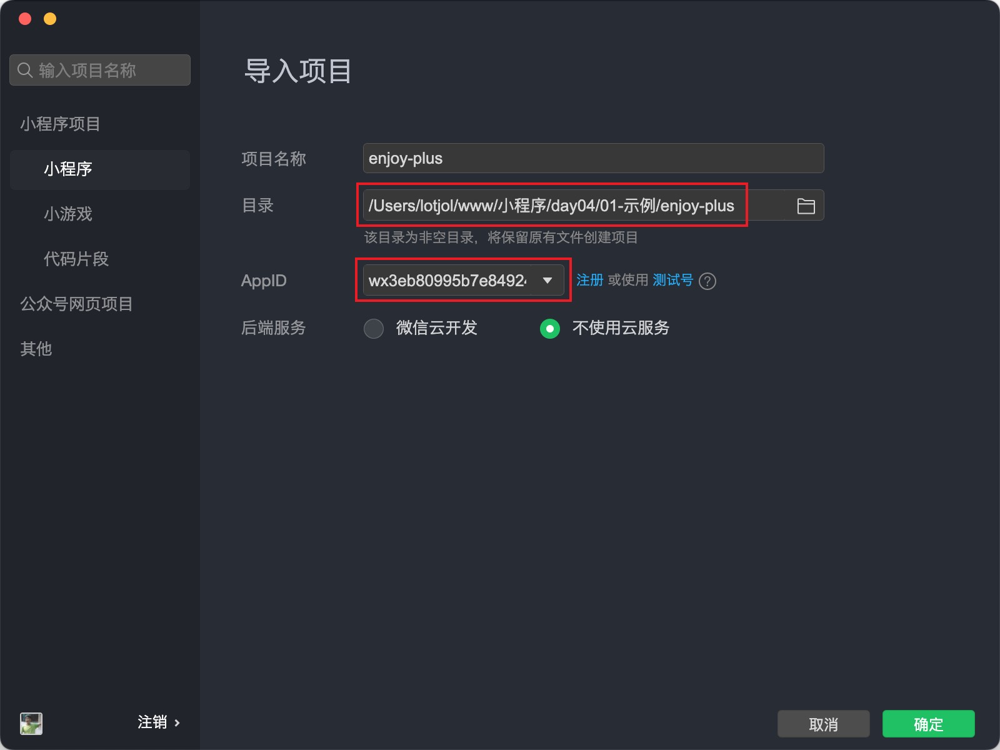

# 启动项目

## 1.1 拉取代码

享+社区小程序项目静态页面已经完成，我们的任务是联调接口处理业务逻辑，以下是代码仓库地址：

```bash
# gitHub 仓库
git clone -b template https://github.com/lotjol/enjoy-plus.git
# 或 gitee 仓库
git clone -b template https://gitee.com/lotjol/enjoy-plus.git
```

通过 `git clone` 拉取代码时默认会将远仓库地址指向了我的的仓库，会导致同学们 `push` 代码时失败，如果在企业中的情况下，需要联系负责人将你添加为团队开发者获取权限。

在课堂上老师就不一一添加大家成为开发者了，同学们自已建一个远程仓库，然后修改代码的远程仓库地址：

```bash
git remote set-url origin '这里是你的远程仓库地址'
```

::: warning 注意:
在企业中做开发时不需要也不允许把代码放到个人仓库下的，切记切记！！！
:::

## 1.2 运行小程序

打开小程序开发者工具后选择导入小程序项目，然后导入刚刚拉取下来的代码，还要把 AppID 更换成同学位各自的。

::: tip 提示:
如果到企业里做开发时，这里的 AppID 要使用公司申请好的，然后联系团队负责人把你添加成为开发者。
:::



## 1.3 熟悉环境

安装享+社区项目的依赖，当前需要安装的依赖是 `eslint` 和 `prettier` 以及 `Vant`:

```bash
npm install
```


`prettier` 中现有的配置:


```json
// .prettier
{
  "semi": false,
  "printWidth": 120,
  "singleQuote": true
}
```

`eslint` 中现有的配置内容:

```javascript
// .eslint.js
module.exports = {
  root: true,
  env: {/*...*/},
  parserOptions: {/*...*/},
  globals: {/*...*/},
  extends: 'eslint:recommended',
  rules: {},
}
```

还有一点要注意的是 `project.config.js` 中的几个配置：

```json
{
  "miniprogramRoot": "miniprogram/",
  "setting": {
    "useCompilerPlugins": ["sass"],
    "packNpmManually": true,
    "packNpmRelationList": [
      {
        "packageJsonPath": "./package.json",
        "miniprogramNpmDistDir": "./miniprogram"
      }
    ],
  }
}
```

- 配置项 `miniprogramRoot` 享+社区项目的根目录为 `miniprogram`
- 配置项 `setting.useCompilerPlugins` 启用了 `sass` 支持
- 配置项 `packNpmRelationList` 指定了 npm 构建时所需的 `package.json` 的位置以及构建后代码的生成位置

## 1.4 vscode

vscode 在编写代码方面比微信小程序更加方便，也更加符合大家的开发习惯，咱们在开发小程序时可以结合这两款工具，我们编写代码使用 vscode，预览、调试、发布等使用小程序开发者工具。

在 vscode 中无法原生支持 `.wxml` 文件的语法高亮及提示，需要安装一个插件:
`WXML - Language Service`

::: tip 提示:
完全使用小程序开发者工具是没有问题的，只是结合 vscode 编写代码会更方便一些。
:::
