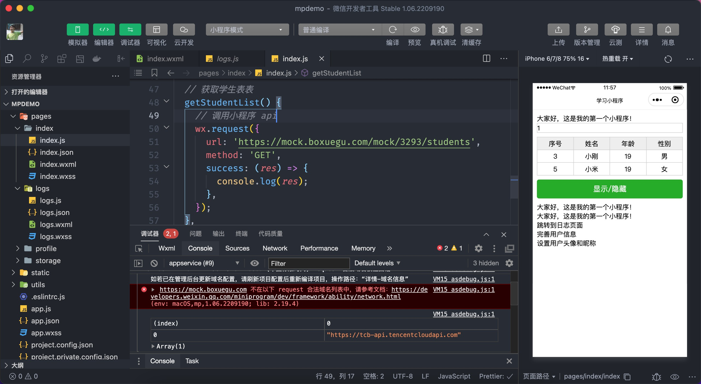
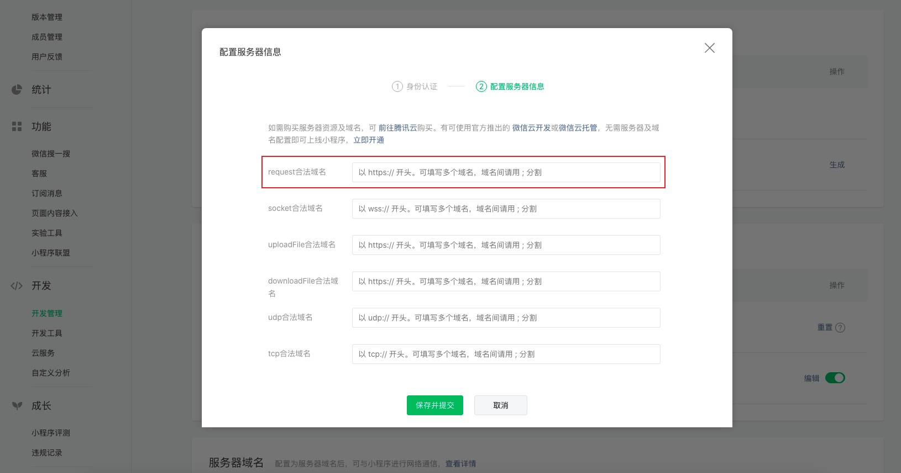
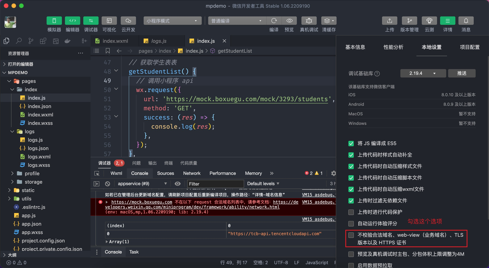
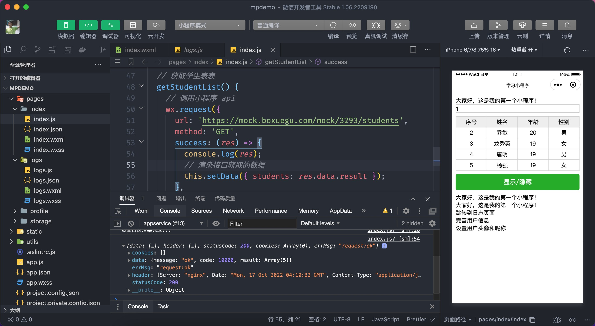
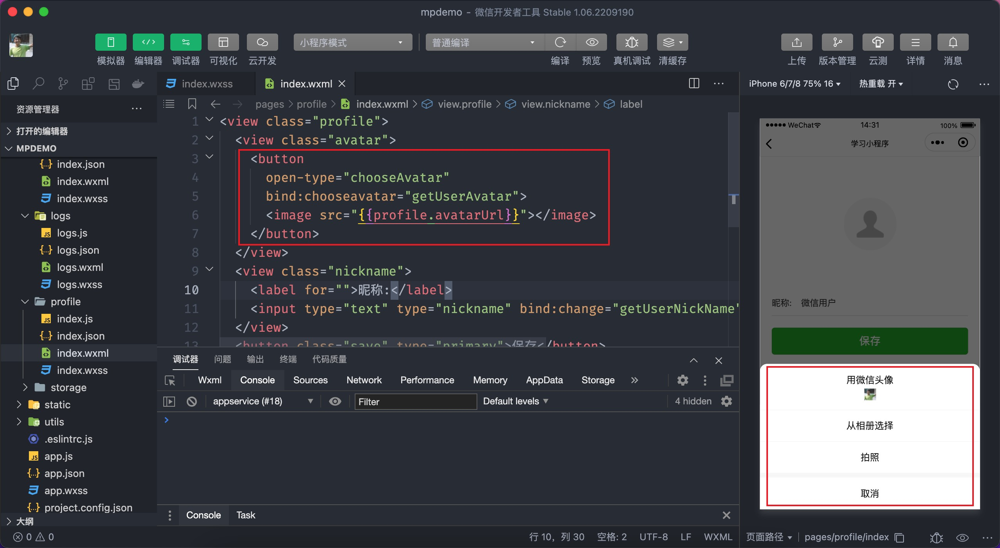
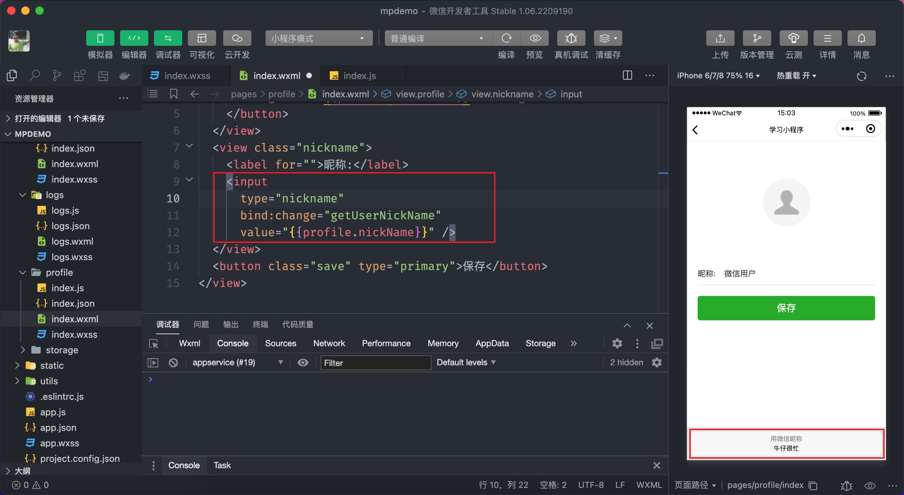

# 内置 API

小程序 API 是小程序**内置提供**的一系列的方法，通过这些方法能够实现许多的功能，比如网络请求、本地存储、微信支付、拍照、扫码等，这些 API 通过全局对象 `wx` 进行调用。

## 3.1 网络请求

`wx.request` API 是用来发起网络请求的，类似于网页中的 `ajax`，其用法如下所示：

```javascript
// pages/index/index.js
// 小程序发起网络请求（调用接口）的方法
wx.request({
  // 接口地址
  url: 'api/path/xxx',
  // 请求的方法
  method: 'GET｜POST|PUT',
  // 请求时的数据
  data: {},
  success(res) {
    // 成功响应的回调
  },
  // ...
})
```

### 3.1.1 获取学生列表

我们以获取学生列表数据为例来练习 `wx.request` 的使用：

```javascript
// pages/index/index.js
Page({
  // ...前面小节代码省略
  onLoad() {
    // 页面加载完成即获取学生列表
    this.getStudentList()
  },
  // 获取学生表表
  getStudentList() {
    // 调用小程序 api
    wx.request({
      url: 'https://mock.boxuegu.com/mock/3293/students',
      method: 'GET',
      success: (res) => {
        console.log(res)
      },
    })
  },
})
```

非常不幸，上述代码的执行时会报告一个错误，如下图：



小程序规定 `wx.request` 调用接口的服务器地址（域名）必须事先在小程序的管理后台进行设置，否则是不允许发起网络请求，如何解决这个问题呢？有两种方式：

- 在小程序管理后台进行设置
- 在小程序开发工具中进行设置

管理后台设置步骤见下图：



::: warning
域名有个严格的要求：**必须**是 `https` 协议且已备案！
:::

在开发工具中设置步骤如下：



::: warning 注意:
在开发工具中设置的方式只适用于开发环境，即只能在小程序开发者工具中生效。
:::

故障到此就排除了，再来测试看是否能够正常调用接口来获取数据了。



成功获取数据后数据就能渲染到页面中显示了。

**调用 `wx.request` 发起请求成功响应后返回的数据格式为：**

```json
{
  cookies: []
  data: {}
  errMsg: "request:ok"
  header: {}
  statusCode: 200
}
```

::: tip 提示:
上述演示接口返回的学生列表信息是随机生成的，即每次调用的结果都是不相同的。
:::


## 3.2 界面交互

小程序还提供了一些用于界面交互的 API，如加载提示、信息反馈、确认框等。

### 3.2.1 加载提示

加载提示框常配合网络请求来使用，用于增加用户体验，对应的 API 有两个，分别为：

- `wx.showLoading` 显示加载提示框
- `wx.hideLoading` 隐藏加载提示框

它们的语法如下：

```javascript
// 显示加载提示
wx.showLoading({
  title: '正在加载...',
  mask: true,
})
// 隐藏加载提示
wx.hideLoading()
```

结合上一节获取学生列表来演示这两个 API 的使用：

```javascript{9-12,27}
// pages/index/index.js
Page({
  // ...省略前面小节代码

  // 获取学生表表
  getStudentList() {
    // 显示提示框
    wx.showLoading({
      title: '正在加载...',
      mask: true,
    })

    // 发起请求
    wx.request({
      url: 'https://mock.boxuegu.com/mock/3293/students',
      method: 'GET',
      // 这里注意因为 this 的原因，推荐使用箭头函数
      success: (res: RequestSuccessResult) => {
        this.setData({
          // 更新 students 数组
          students: res.data.result,
        })
      },
      complete() {
        // 隐藏提示框
        wx.hideLoading()
      },
    })
  },
})
```

在调用 `wx.showLoading` 时可以传入以下参数：

- `title` 指定显示的文字提示内容（不能省略）
- `mask` 提供一个透明层阻止对页面其它内容进行操作
- `success` 显示加载提示框成功后的回调（很少用到）
- `fail` 显示加载提示框失败后的回调（很少用到）
- `complete` 显示加载提示框完成后的回调（包括成功和失败两种情况）

### 3.2.2 信息反馈

信息反馈是指根据用户的某些操作来告知操作的结果，如用户点击加入购物车，提示用户添加成功，用户提交表单提示用户表单验证的结果等，对应的 API 是 `wx.showToast`

其语法如下：

```javascript
wx.showToast({
  title: '姓名只能为汉字!'
  duration: 2000,
  mask: true,
  icon: 'success'
})
```

以表单验证举例说明 API 的使用：

```xml
<!-- pages/index/index.wxml -->
<!-- 省略了部分代码 -->
<input type="text" model:value="{{username}}" placeholder="请填写您的姓名" />
<button type="primary" bind:tap="submitForm">提交</button>
```

```javascript{9,14-27}
// 调用 Page 函数
// pages/index/index
Page({
  data: {
    msg: '大家好，这是我的第一个小程序！',
    number: 1,
    seen: true,
    isLogin: true,
    username: '',
    students: [],
  },

  // 省略部分代码...

  submitForm() {
    console.log(this.data.username);
    // 验证姓名只能为汉字
    const reg = /^[\u4e00-\u9fa5]{2,5}$/;
    // 验证结果
    const valid = reg.test(this.data.username.trim());
    // 提示验证结果
    if (!valid) {
      return wx.showToast({
        title: '姓名只能为2到5位汉字!',
        icon: 'none',
      });
    }
  },
});

```

在调用 `wx.showToast` 时可以传入以下参数：

- `title` 指定显示的文字提示内容（不能省略）
- `mask` 提供一个透明层阻止对页面其它内容进行操作
- `icon` 指定图标类型
- `duration` 指定信息反馈的显示时长
- `success` 信息反馈成功后的回调（很少用到）
- `fail` 信息反馈失败后的回调（很少用到）
- `complete` 信息反馈完成后的回调（包括成功和失败两种情况）


## 3.3 本地存储

小程序中也能够像网页一样支持本地存储数据，用于在本地存一些临时性的数据，比如包含的用户登录状态 token 等，其包含以下 4个主要的 API：

- `wx.setStorageSync` 在本地存入一个数据
- `wx.getStorageSync` 读取本地的一个数据
- `wx.removeStorageSync` 删除本地存储的一个数据
- `wx.clearStorageSync` 清空本地存储的数据

::: tip 提示:
在小程序中 `Sync` 结尾的 API 指的是同步方式执行，同步方式执行的 API 在使用时简洁比较好，但缺点是同步会阻塞程序执行，执行效率上相较异步版本要差一些。
:::

### 3.3.1 存入数据

如下代码所示调用 API `wx.setStorageSync` 在小程序本地存入数据

```javascript
// pages/storage/index.js
Page({
  // 存入本地数据
  setStorage() {
    wx.setStorageSync('name', '小明')
    // 可以直接存入对象，无需 JSON.stringify 处理
    wx.setStorageSync('user', { name: '小明', age: 18 })
  },
})
```

::: tip
注意在小程序中本地存储可以直接存入对象或数组类型的数据，无需要 `JSON.stringify` 进行处理。
:::

### 3.3.2 读取数据

如下代码所示调用 API `wx.getStorageSync` 读取本地存储中的数据

```javascript{10-14}
// pages/storage/index.js
Page({
  // 存入本地数据
  setStorage() {
    wx.setStorageSync('name', '小明')
    // 可以直接存入对象，无需 JSON.stringify 处理
    wx.setStorageSync('user', { name: '小明', age: 18 })
  },
  // 读取本地数据
  getStorage() {
    const name = wx.getStorageSync('name')
    // 对象类型的数据不必 JSON.parse 处理
    const user = wx.getStorageSync('user')
  },
})
```

::: tip
注意由于存入本地的数据并没有进行 `JSON.stringify` 处理，因此取出来的数据也不必进行 `JSON.parase` 处理了。
:::

### 3.3.3 删除数据

如下代码所示调用 API `wx.removeStorageSync` 删除本地存储的数据

```javascript{16-18}
// pages/storage/index.js
Page({
  // 存入本地数据
  setStorage() {
    wx.setStorageSync('name', '小明')
    // 可以直接存入对象，无需 JSON.stringify 处理
    wx.setStorageSync('user', { name: '小明', age: 18 })
  },
  // 读取本地数据
  getStorage() {
    const name = wx.getStorageSync('name')
    // 对象类型的数据不必 JSON.parse 处理
    const user = wx.getStorageSync('user')
  },
  // 删除数据
  removeStorage() {
    wx.removeStorageSync('name')
  },
  // 清空数据
  clearStorage() {
    wx.clearStorageSync()
  },
})
```

### 3.3.4 清空数据
如下代码所示调用 API `wx.clearStorageSync` 删除本地存储的数据

```javascript{20-22}
// pages/storage/index.js
Page({
  // 存入本地数据
  setStorage() {
    wx.setStorageSync('name', '小明')
    // 可以直接存入对象，无需 JSON.stringify 处理
    wx.setStorageSync('user', { name: '小明', age: 18 })
  },
  // 读取本地数据
  getStorage() {
    const name = wx.getStorageSync('name')
    // 对象类型的数据不必 JSON.parse 处理
    const user = wx.getStorageSync('user')
  },
  // 删除数据
  removeStorage() {
    wx.removeStorageSync('name')
  },
  // 清空数据
  clearStorage() {
    wx.clearStorageSync()
  },
})
```

除了上述的4个 API 外，还有4个与之对应的异步版本的API：

- `wx.setStorage` 在本地存入一个数据
- `wx.getStorage` 读取本地的一个数据
- `wx.removeStorage` 删除本地存储的一个数据
- `wx.clearStorage` 清空本地存储的数据

调用异步方式的 API 传入的是一个对象类型的参数：

```javascript
Page({
  setStorage() {
    wx.setStorage({
      key: 'name',
      data: '小明'
    })
    // 等同于
    wx.setStorage('name', '小明')
  }
})
```

::: tip 提示:
在小程序中 `Sync` 结尾的 API 指的是同步方式执行，同步方式执行的 API 在使用时简洁比较好，但缺点是同步会阻塞程序执行，执行效率上相较异步版本要差一些。
:::

## 3.4 头像昵称填写

小程序开发过程中获取用户昵称和头像是比较常见的功能，新建一个页面 `profile` 来演示该功能的实现步骤。

::: tip 提示:
演示用户头像和昵称的页面样式提前写好了，大家把这些样式拷贝过去即可。
:::

```css
.profile {
  display: flex;
  flex-direction: column;
  padding-top: 100rpx;
}

.profile .avatar button {
  background-color: transparent;
}

.profile .avatar button::after {
  border: none;
}

.profile image {
  width: 180rpx;
  height: 180rpx;
  border-radius: 50%;
}

.profile .nickname {
  display: flex;
  align-items: center;
  height: 88rpx;
  margin-top: 100rpx;
  color: #333;
  font-size: 30rpx;
  border-bottom: 1rpx solid #ddd;
}

.profile .nickname label {
  width: 100rpx;
}

.save {
  width: 100% !important;
  margin-top: 40rpx;
}
```

### 3.4.1 用户头像

**获取用户头像必须用到 `button` 组件，且用户必须要主动点击 `button` 按钮，以下是 `button` 的使用细节：**

- 设置 `button` 的属性 `open-type` 值为 `chooseAvatar`
- 监听 `button` 的 `chooseavatar` 事件

::: warning 注意
open-type 的属性值 chooseAvatar (有大写字母)，事件类型 chooseavatar (全部小写字母)。
:::



如上图所示用户点击了按钮后会弹出一个选择列表，无论是选择微信头像、相册选择、还是拍照都会触发事件 `chooseavatar`，在事件回调函数中来获取用户头像的图片地址：

```xml{4-9}
<!-- pages/profile/index.wxml -->
<view class="profile">
  <view class="avatar">
    <button
      open-type="chooseAvatar"
      bind:chooseavatar="getUserAvatar"
    >
      <image src="{{profile.avatarUrl}}"></image>
    </button>
  </view>
  <view class="nickname">
    <label for="">昵称:</label>
    <input type="text" value="{{profile.nickName}}" />
  </view>
  <button class="save" type="primary">保存</button>
</view>
```

在事件回调 `getUserAvatar` 中获取到用户的头像地址，通过这个地址就可以将用户设置的头像展示到页面当中了。

```typescript
// pages/profile/index.js
Page({
  data: {
    profile: {
      avatarUrl: '/static/images/avatar.png',
      nickName: '微信用户',
    },
  },
  // 获取用户头像
  getUserAvatar(ev) {
    // 获取头像对应的地址
    // console.log(ev.detail.avatarUrl)
    this.setData({
      'profile.avatarUrl': ev.detail.avatarUrl,
    })
  },
})
```

同学们有没有注意到上面代码中调用 `setData` 时使用了 `'profile.avatarUrl'` ，这是小程序特别支持更新数据的用法，它等同于下面的写法：

```javascript
this.setData({
  // 这种写法没有上述语法简洁
  profile: {
    avatarUrl: ev.detail.avatarUrl,
  },
})
```

**此时得到的头像地址是临时地址，只能在小程序内部使用，要实现永久存储需要将这个图片上传给自已的服务端，文件上传会用到 `wx.uploadFile`。**

```javascript{10-17}
// pages/profile/index.js
Page({
  // 省略部分代码...
  getUserAvatar(ev) {
    this.setData({
      'profile.avatarUrl': ev.detail.avatarUrl,
    });

    // 上传临时文件
    wx.uploadFile({
      url: 'http://ajax-api.itheima.net/api/file',
      filePath: ev.detail.avatarUrl,
      name: 'avatar',
      success: (res) => {
        console.log(res);
      },
    });
  },
})
```

### 3.4.2 用户昵称

**获取用户头像必须用到 `input` 组件，当 `input` 获得焦点后小程序会自动展示用户的昵称 以下是 `input` 的使用细节：**

- 设置 `input` 的 `type` 属性值为 `nickname`
- 监听 `input` 组件的 `input` 、`blur` 、`change` 等事件获取表单中的值



如上图所示当 `input` 组件获得焦点时，页面的底部自动弹出用户默认的昵称，用户选择后会自动填入表单当中，用户也可以在表单中填写内容对昵称进行自定义。

那如何获取用户在表单中填写的用户昵称呢？
用户在表单中填写的内容（昵称）需要事件回调中通过事件对象来获取，事件类型可以是 `input`、`blur` 、`change`等事件：

::: warning
小程序的文档中并没有标明 input 组件能够监听 change 事件，经部分测试后发现能够支持 change 事件的监听，生产环境应用时要注意！
:::

```xml{13-17}
<!-- pages/profile/index.wxml -->
<view class="profile">
  <view class="avatar">
    <button
      open-type="chooseAvatar"
      bind:chooseavatar="getUserAvatar"
    >
      <image src="{{profile.avatarUrl}}"></image>
    </button>
  </view>
  <view class="nickname">
    <label for="">昵称:</label>
    <input
      type="nickname"
      bind:change="getUserNickName"
      value="{{profile.nickName}}"
    />
  </view>
  <button class="save" type="primary">保存</button>
</view>
```

在事件回调 getUserNickName 中获取到用户昵称，然后将昵称展示到页面当中。

```javascript{16-21}
// pages/profile/index.js
Page({
  data: {
    profile: {
      avatarUrl: '/static/images/avatar.png',
      nickName: '微信用户',
    },
  },
  // 获取用户头像
  getUserAvatar(ev) {
    // 获取头像对应的地址
    this.setData({
      'profile.avatarUrl': ev.detail.avatarUrl,
    })
  },
  getUserNickName(ev) {
    // 获取用户设置的昵称
    this.setData({
      'profile.nickName': ev.detail.value,
    })
  },
})
```

练习：将获取到的用户头像和昵称存入小程序本地。


## 3.5 路由

小程序中的路由其实单纯只是页面的跳转，一般在页面中使用 `navigator` 组件来实现，也有很多场景需要在 js 中根据逻辑的执行结果跳转到某个页面，比如检测到用户尚未登录就跳转到登录页面。

### 3.5.1 wx.navigateTo

`wx.navigateTo` 跳转到一个新的页面，会新增一种历史记录

```javascript
// /pages/router/index.js
Page({
  // 普通的跳转
  navigateTo() {
    wx.navigateTo({
      url: '/pages/logs/logs?name=小刚&age=19',
      success() {}
    });
  },
})
```

通过 `wx.navigateTo` 跳转页面通过左上角的能够实现返回操作，如果要跳转的页面路径是一个 tabBar 的页时，不能使用 `wx.navigateTo`。

### 3.5.2 wx.redirectTo

`wx.redirectTo` 跳转到一个新的页面，**不会新增一种历史记录**，替换掉当前页面。

```javascript
// /pages/router/index.js
Page({
  // 和 navigateTo 很类似，区别在于不会新增历史记录
  redirectTo() {
    wx.redirectTo({
      url: '/pages/logs/logs?name=小刚&age=19',
    });
  },
});
```

### 3.5.5 wx.navigateBack

`wx.navigateBack` 返回页面，参数 `delta` 可以指定返回前几个页面。

```javascript
// /pages/router/index.js
Page({
  // 返回页面
  navigateBack() {
    wx.navigateBack({
      // 回退多少步
      delta: 0,
    });
  },
});

```

## 3.6 其它

小程序中大部分的 API 都是异步方式执行，异步 API 传入的都是对象类型的参数，且都可以传入 `success`、`fail`、`complete` 回调函数。

也有少部分 API 是同步方式执行，同步方式的 API 有个特点就是均以 `Sync` 结尾。