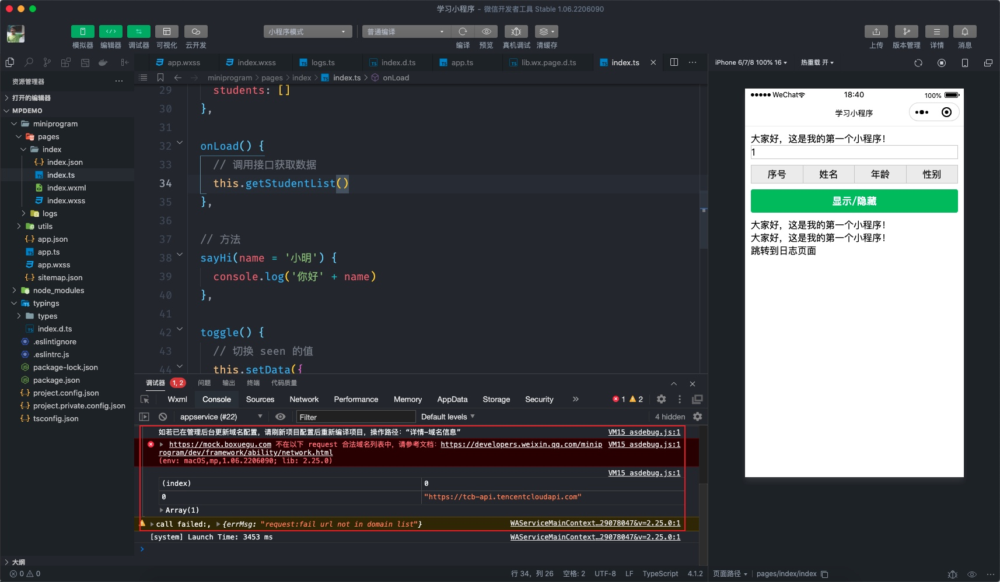
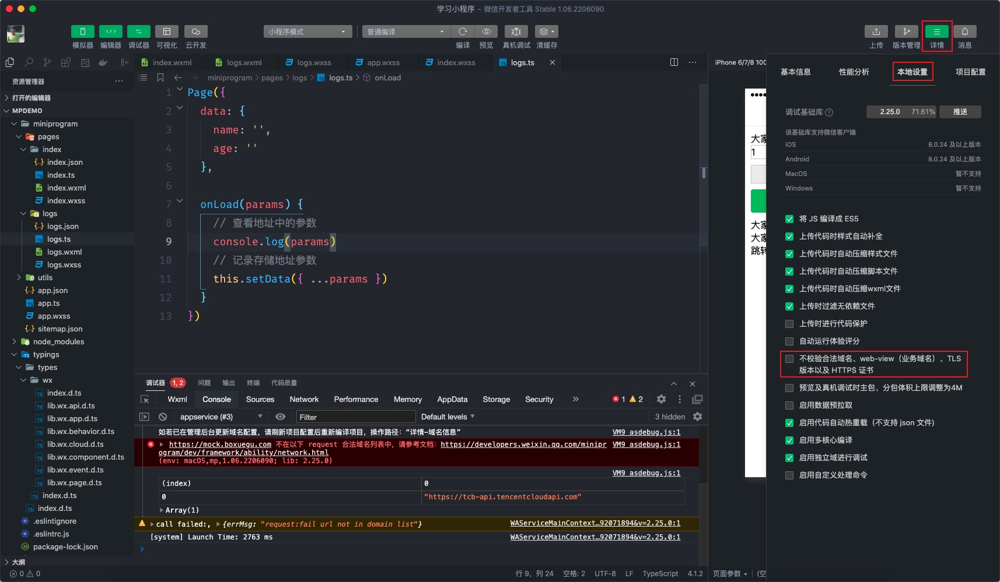
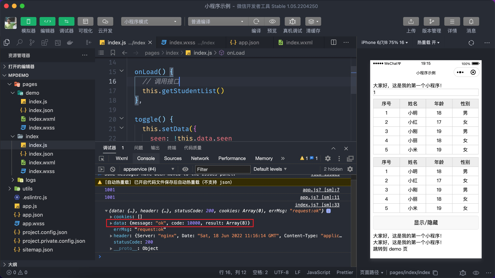
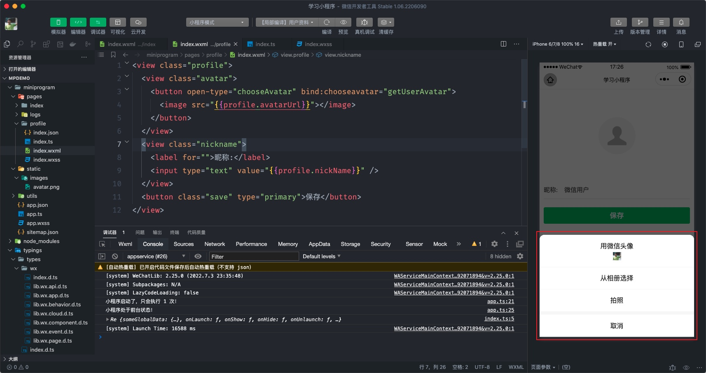
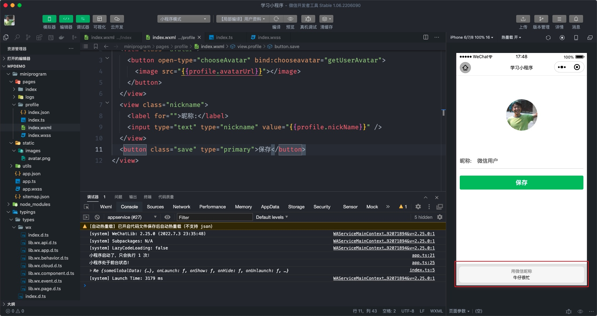
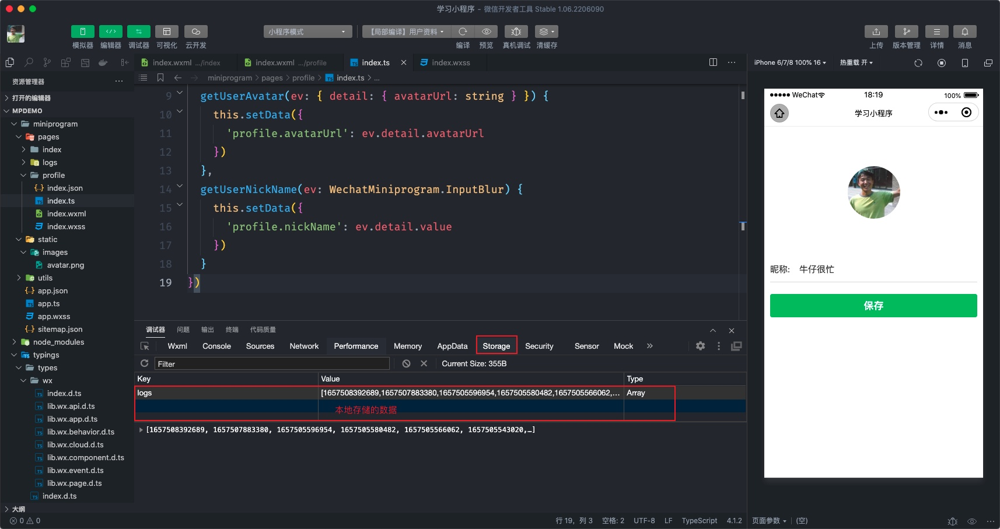

# 内置 API

小程序 API 是小程序**内置提供**的一系列的方法，通过这些方法能够实现许多的功能，比如网络请求、本地存储、微信支付、拍照、扫码等。

## 4.1 渲染学生列表

我们要学习第一个 API 是 `wx.request` 这个 API 是用来发起网络请求的，其用法如下所示：

```javascript
// 小程序发起网络请求（调用接口）的方法
wx.request({
  // 接口地址
  url: 'api/path/xxx',
  // 请求的方法
  method: 'GET｜POST|PUT',
  // 请求时的数据
  data: {},
  success(res) {
    // 成功响应的回调
  },
})
```

那我们来编写代码在小程序中调用接口来获取学生列表数据做为演示：

```javascript
// pages/index/index.ts
// ...前面小节代码省略

// 调用 Page 函数
Page({
  // ...前面小节代码省略
  onLoad() {
    this.getStudentList()
  },
  // 获取学生表表
  getStudentList() {
    // 调用小程序 api
    wx.request({
      url: 'https://mock.boxuegu.com/mock/3293/students',
      method: 'GET',
      success: (res) => {
        console.log(res)
      },
    })
  },
})
```

非常不幸，上述代码的执行时会报告一个错误，如下图：



这个错误是啥咋回事件呢？小程序规定 `wx.request` 调用的接口的服务器地址（域名）必须事先在小程序的管理后台进行设置，否则是不允许发起请求的，所以我们在在使用 `wx.request` 之前先要在管理后台设置才行。

设置步骤见下图：


::: warning
域名有个严格的要求：**必须**是 `https` 协议且已备案！
:::

当然还有一种**临时**的手段在不设置域名的情况下使用 `wx.request` 只需要在开发者工具中设置就可以了，**但是只适用于开发环境当中**，我们也来了解一下，如下图所示：



故障到此就排除了，再来测试看是否能够正常调用接口来获取数据了。



成功获取数据后数据就能渲染到页面中显示了。

::: tip
上述演示接口返回的学生列表信息是随机生成的，即每次调用的结果都是不相同的。
:::

小程序的类型声明中关于 `wx.request` 响应结果的类型允许根据用户自定义，即支持泛型参数，根据接口返回数据的格式定义如下：

```typescript
// wx.request 响应结果类型定义
type RequestSuccessResult = WechatMiniprogram.RequestSuccessCallbackResult<{
  code: number
  message: string
  result: []
}>
```

::: tip
请求响应结果类型的定义应定义为全局的，为了方便演示暂时先在当前页面进行声明
:::

```javascript{3-7,22}
// pages/index/index.ts
// 响应结果类型定义
type RequestSuccessResult = WechatMiniprogram.RequestSuccessCallbackResult<{
  code: number,
  message: string,
  result: [],
}>

// ...省略前面小节的代码

// 调用 Page 函数
Page({
  // ...省略前面小节的代码

  // 获取学生表表
  getStudentList() {
    // 调用小程序 api
    wx.request({
      url: 'https://mock.boxuegu.com/mock/3293/students',
      method: 'GET',
      // 这里注意因为 this 的原因，推荐使用箭头函数
      success: (res: RequestSuccessResult) => {
        this.setData({
          // 更新 students 数组
          students: res.data.result,
        })
      },
    })
  },
})
```

至此我们就掌握了如何在小程序中调用接口获取数据了，我们再来做一些优化，在网络请求的过程中给用户一个加载提示，小程序提供了另外两个 API 来实现这个功能，分别为`wx.showLoading` 和 `wx.hideLoading` 。

它的语法如下：

```javascript
// 显示加载提示
wx.showLoading({
  title: '正在加载...',
  mask: true,
})
// 隐藏加载提示
wx.hideLoading()
```

我们来把这两个 API 用到接口调用当中：

```javascript{12-15,28-30}
// pages/index/index.ts

// ...省略前面小节代码

// 调用 Page 函数
Page({
  // ...省略前面小节代码

  // 获取学生表表
  getStudentList() {
    // 显示提示框
    wx.showLoading({
      title: '正在加载...',
      mask: true,
    })

    // 发起请求
    wx.request({
      url: 'https://mock.boxuegu.com/mock/3293/students',
      method: 'GET',
      // 这里注意因为 this 的原因，推荐使用箭头函数
      success: (res: RequestSuccessResult) => {
        this.setData({
          // 更新 students 数组
          students: res.data.result,
        })
      },
      complete() {
        // 隐藏提示框
        wx.hideLoading()
      },
    })
  },
})
```

## 4.2 头像昵称填写

获取用户昵称和头像是小程序中比较常见的功能，为此有专门的方法来获取用户头像和昵称，新建 `profile` 页面来演示该功能的实现步骤。

::: tip
演示用户头像和昵称的页面样式提前写好了，大家把这些样式拷贝过去即可。
:::

```css

```

1. 获取用户的头像有 2 个要求：
   - 用户必须要点击 `button` 组件， `open-type` 属性的值设置成 `chooseAvatar`
   - 监听 `button` 组件的 `chooseavatar` 事件



如上图所示无论是选择微信头像、相册选择、还是拍照都会触发事件 `chooseavatar`，`getUserAvatar` 为我们自定义的事件回调函数，在该事件回调函数中通过事件对象来获取用户头像的图片地址：

```xml
<!-- pages/profile/index.wxml -->
<view class="profile">
  <view class="avatar">
    <button open-type="chooseAvatar" bind:chooseavatar="getUserAvatar">
      <image src="{{ profile.avatarUrl }}"></image>
    </button>
  </view>
  <view class="nickname">
    <label for="">昵称:</label>
    <input type="text" value="{{ profile.nickName }}" />
  </view>
  <button class="save" type="primary">保存</button>
</view>
```

```typescript
// pages/profile/index.ts
Page({
  data: {
    profile: {
      avatarUrl: '/static/images/avatar.png',
      nickName: '微信用户',
    },
  },
  // 获取用户头像
  getUserAvatar(ev: { detail: { avatarUrl: string } }) {
    // 获取头像对应的地址
    // console.log(ev.detail.avatarUrl)
    this.setData({
      'profile.avatarUrl': ev.detail.avatarUrl,
    })
  },
})
```

同学们有没有注意到上面代码中调用 `setData` 时使用了 `'profile.avatarUrl'` ，这是小程序特别支持更新数据的用法，它等同于下面的写法：

```typescript
this.setData({
  // 这种写法没有上述语法简洁
  profile: {
    avatarUrl: ev.detail.avatarUrl,
  },
})
```

1. 获取用户昵称也需要 2 个要求：
   - 使用 `input` 组件，`type` 属性的值设置成 `nickname`
   - 监听 `input` 组件的 `input` 、`blur` 、`change` 等事件



如上图所示当 `input` 组件获得焦点时，页面的底部自动弹出用户默认的昵称，用户选择后会自动填入表单当中，也可以在表单中填写内容对昵称进行自定义。

那如何获取用户在表单中填写的用户昵称呢？
用户在表单中填写的内容（昵称）需要事件回调中通过事件对象来获取，事件类型可以是 `input`、`blur` 、`change`等事件：

```xml
<!-- pages/profile/index.wxml -->
<view class="profile">
  <view class="avatar">
    <button open-type="chooseAvatar" bind:chooseavatar="getUserAvatar">
      <image src="{{ profile.avatarUrl }}"></image>
    </button>
  </view>
  <view class="nickname">
    <label for="">昵称:</label>
    <input type="text" type="nickname" bind:change="getUserNickName" value="{{ profile.nickName }}" />
  </view>
  <button class="save" type="primary">保存</button>
</view>
```

```typescript
// pages/profile/index.ts
Page({
  data: {
    profile: {
      avatarUrl: '/static/images/avatar.png',
      nickName: '微信用户',
    },
  },
  // 获取用户头像
  getUserAvatar(ev: { detail: { avatarUrl: string } }) {
    // 获取头像对应的地址
    this.setData({
      'profile.avatarUrl': ev.detail.avatarUrl,
    })
  },
  getUserNickName(ev: WechatMiniprogram.InputBlur) {
    // 获取用户设置的昵称
    this.setData({
      'profile.nickName': ev.detail.value,
    })
  },
})
```

同学们注意在上述的代码中 `WechatMiniprogram.InputBlur` 是小程序中表单事件对象的类型声明。

## 4.3 本地存储

小程序中也能够像网页一样支持本地存储数据。



1. 存入数据 `wx.setStorageSync`

```typescript
// pages/storage/index.ts
Page({
  // 存入本地数据
  setStorage() {
    wx.setStorageSync('name', '小明')
    // 可以直接存入对象，无需 JSON.stringify 处理
    wx.setStorageSync('user', { name: '小明', age: 18 })
  },
})
```

同学们注意在小程序中本地存储可以直接存入对象或数组类型的数据，无需要 `JSON.stringify` 进行处理。

2. 读取数据 `wx.getStorageSync`

```typescript
// pages/storage/index.ts
Page({
  // 存入本地数据
  setStorage() {
    wx.setStorageSync('name', '小明')
    // 可以直接存入对象，无需 JSON.stringify 处理
    wx.setStorageSync('user', { name: '小明', age: 18 })
  },
  // 读取本地数据
  getStorage() {
    const name = wx.getStorageSync('name')
    // 对象类型的数据不必 JSON.parse 处理
    const user = wx.getStorageSync('user')
  },
})
```

同学们注意由于存入本地的数据并没有进行 `JSON.stringify` 处理，因此取出来的数据也不必进行 `JSON.parase` 处理了。

3. 删除数据 `wx.removeStorageSync`

```typescript
// pages/storage/index.ts
Page({
  // 存入本地数据
  setStorage() {
    wx.setStorageSync('name', '小明')
    // 可以直接存入对象，无需 JSON.stringify 处理
    wx.setStorageSync('user', { name: '小明', age: 18 })
  },
  // 读取本地数据
  getStorage() {
    const name = wx.getStorageSync('name')
    // 对象类型的数据不必 JSON.parse 处理
    const user = wx.getStorageSync('user')
  },
  // 删除数据
  removeStorage() {
    wx.removeStorageSync('name')
  },
  // 清空数据
  clearStorage() {
    wx.clearStorageSync()
  },
})
```

注意 `removeStorageSync` 和 `clearStorageSync` 的区别，`removeStorageSync` 是删除某个指定的数据，`clearStorageSync` 是将本地所有的数据都删除（很少用到）。

## 4.4 其它
