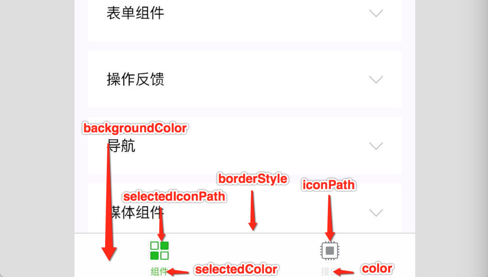

# 基础知识

小程序开发的方式与 Web 非常类似，使用 Javascript 做为开发语言，使用 CSS 来实现页面的布局，除此之外还内置了许多功能丰富的组件，如地图、富文本、轮播图等。

## 2.1 创建小程序

通过小程序开发者工具创建一个新的项目，步骤如下图所示：

1. 点击 + 号，新建项目

   

2. 填写项目信息

   
   
   如上图所示填写信息时 AppID 填写各自申请的小程序账号的 AppID，不使用云开发，选择 Javascript 基础模板。

   ::: warning 注意:
   创建小程序的目录必须是空目录且当前电脑要处理联网状态。
   :::

3. 启动小程序项目

   小程序开发者工具会自动启动创建好的小程序并初始了小程序的目录结构，如下图所示：

   

## 2.2 目录结构

创建小程序项目后会初始小程序的目录结构，我们先来了解一下这些文件和目录的作用，这对于我们学习小程序开发非常有帮助。

我们将从两个方面入手来介绍小程序的目录结构：文件类型和特定名称的文件。

先来看文件类型，小程序主要提供了 4 种文件类型：

| 类型名称 | 作用                   | 是否必须存在 |
| -------- | ---------------------- | ------------ |
| .wxml    | 用于页面的布局结构，相当于网页中 .html 文件 | 是           |
| .wxss    | 用于页面的样式，相当于网页中的 .css 文件    | 否           |
| .js      | 用于页面的逻辑                  | 是           |
| .json    | 用于页面的配置               | 否           |

**我们知道的是小程序的每个页面都是由以这4种文件类型的文件共同构成的且四个文件必须是相同的名字**。

再来看一些**特定名称**的文件：

| 文件名              | 作用                    | 是否必须存在     |
| ------------------- | ---------------------- | ---------------- |
| app.js              | 小程序入口（首先执行的文件） | 是               |
| app.json            | 小程序的**全局配置**      | 是               |
| app.wxss            | 小程序的**全局样式**        | 否               |
| project.config.json | 小程序**开发者工具配置**     | 是（会自动创建） |
| sitemap.json        | 小程序搜索优化               | 否               |

以上关于文件类型及特定文件相关的细节，后续学习过程中会逐步讲解，在此只是先对目结构有个大致的了解！

## 2.3 牛刀小试

需求：将小程序页面中的文字颜色变成红色，字号变成 20px。

通过上面的讲解我们知道 .wxml 是用来定义页面内容及结构的，所以我们先从 .wxml 入手，打开 `pages/index/index.wxml` 找到如下代码：

```xml
<!-- 第 20 ~ 22 行 -->
<view class="usermotto">
  <text class="user-motto">{{motto}}</text>
</view>
```

在此基础上改变一些内容（加了几个感叹号），保存代码后，页面中立刻发生了变化（刷新）

```xml{3}
<!-- 第 20 ~ 22 行 -->
<view class="usermotto">
  <text class="user-motto">{{motto}}!!!</text>
</view>
```

::: tip 提示:
通过这一步操作体会一下 .wxml 类型的文件相当于 html 用来定义页面中的内容和结构。
:::

接下来打开 `pages/index/index.wxss`，找到 `.usermotto` 这个选择器，如下代码所示：

```css
/* 第 17 ~ 19 行 */
.usermotto {
  margin-top: 200px;
}
```

在此基础上修改一些样式，设置字号及颜色，保存代码后，页面也会立刻发生变化（刷新）

```css{2,3}
.usermotto {
  font-size: 20px;
  color: red;
  margin-top: 200px;
}
```

::: tip 提示:
通过这一步操作体会一下 .wxss 类型的文件相当于 css 用来定义页面样式，并且似乎（事实也是这样的）和 css 的属性也都是一样的！
:::

至此 .js 和 .json 等其它内容我们后面会有专门的章节进行讲解。

## 2.4 页面导航布局

通过一个小案例来学习小程序页面布局的相关知识，主要涉及到小程序内置的组件（标签）用样式的使用。

下图是比较常见的页面导航布局，要实现这个布局会用到小程序中提供的一些组件（标签）如下表所示：

| 组件名（标签） | 作用             | 与 html 对比               |
| -------------- | ----------- | ------------------ |
| view           | 定义一个块级元素 | 相当于 html 中的 div 标签  |
| text           | 定义一个行内元素 | 相当于 html 中的 span 标签 |

关于小程序页面布局中的样式几乎和网页的 css 是一样的，先学习部分选择器的使用，如下表所示：

| 选择器     | 示例       | 含义                  |
| ---------- | ---------- | ------------------ |
| 类选择器   | .navs      | 根据类名选择元素           |
| 标签选择器 | text、view | 根据标签名选择元素         |
| 后代选择器 | .navs text | 根据标签的嵌套关系选择元素 |

将原来在 `pages/index/index.wxml` 和 `pages/index/index.wxss` 中编写代码删除，然后加关于页面导航布局相关的代码。

完整代码如下所示：

```xml
<!-- pages/index/index.wxml -->
<view class="navs">
  <text class="active">精选</text>
  <text>手机</text>
  <text>食品</text>
  <text>内衣</text>
  <text>生鲜</text>
  <text>母婴</text>
</view>
```

```css
/* pages/index/index.wxss */
.navs {
  display: flex;
  justify-content: space-evenly;
  height: 44px;
  padding: 0 10px;
  line-height: 44px;
  border-top: 1px solid #eee;
  /* background-color: pink; */
}

.navs text {
  width: 50px;
  text-align: center;
  color: #333;
}

.navs .active {
  color: #f5a11c;
  font-size: 18px;
  position: relative;
  top: 2px;
}

.navs .active::after {
  content: '';
  position: absolute;
  left: 50%;
  bottom: 6px;
  height: 2px;
  width: 12px;
  transform: translate(-50%);
  border-radius: 2px;
  background-color: #f5a11c;
}
```

::: tip 提示:
通过上述的小例子大家要体会在编写小程序页面时与网页布局几乎是一致的，所不同的就是小程序中使用了一些特定的组件（组件），关于样式部分和 css 几乎完全一致。
:::

另外大家有没有发现样式文件不需要引入到页面当中，它是自动引入并生效的，但是要求**页面文件的名称和样式的文件必须要一致！**

## 2.5 小程序适配

小程序主要是运行在手机端的，它也需要像移动 Web 一样来处理不同大小屏幕的适配，小程序中适配的方法非常简单，它提供了专门的长度单位 `rpx` 它会自动的根据屏幕的大小转换成 `px` 。

```css
/* 用 px 定义图片的尺寸 */
.preview-image {
  width: 375px;
  height: 160px;
}
```

```css
/* 用 rpx 定义图片的尺寸 */
.preview-image {
  width: 750rpx;
  height: 320rpx;
}
```

在小程序模拟器中对比使用 px 和 rpx 的区别后发现，rpx 在不同的设备中折算成 px 的实际大小是变化的，即针对不同尺寸屏幕进行适配的处理。

还有一点非常重要也必须要知道，小程序的屏幕宽度为 750rpx，即一个盒子的宽度如果设置为 750rpx 时会占满整个小程序的屏幕宽度。

以上便是 rpx 的基本使用情况了，那在实际开发中如何合理的使用 rpx 长度单位呢？

如何使用 rpx 长度单位，取决于设计稿的实际尺寸：

- 如果设计稿是 750px 时，设计稿中是多少 px 在小程序中就写成多少 rpx，即 1 : 1 的关系。
- 如果设计稿是 375px 时，设计算中是多少 px 在小程序中就写在 2倍的 rpx，即 1 : 2 的关系。

实际开发当中设计稿的尺寸都是【以 `750px` 做为基准】，因此只需要将设计稿中看到的尺寸写成相应的 `rpx` 即可。

## 2.6 轮播图交互

为了让大家对小程序内置组件有更多的了解，我们再来看几个功能强大的组件：

| 组件名（标签） | 作用                  | 与 html 对比        |
| -------------- | ----------------- | ------------------- |
| swiper         | 滑块视图容器                    | 无              |
| swiper-item    | 可滑动的区块（用在 swiper 内部）  | 无              |
| image          | 加载图片                       | img（注意名称区别） |

通过 swiper 组件的属性对轮播图的功能进行配置，常见的属性包括：

| 属性名  | 默认值            | 作用                 |
| ------ | ----------------- | -------------------- |
| indicator-dots  | false             | 是否显示面板指示点   |
| autoplay  | false             | 是否自动切换         |
| circular  | false             | 是否采用衔接滑动     |
| indicator-color    | rgba(0, 0, 0, .3) | 指示点颜色           |
| indicator-active-color   | \#000000          | 当前选中的指示点颜色 |
| ... 还有[更多](https://developers.weixin.qq.com/miniprogram/dev/component/swiper.html) |                   |                      |

swiper 的功能强大提供的属性也非常多，不过不用头疼，常用的就几个以后根据开发需求随用随查就可以了。

## 2.7 购物车计数器

对小程序布局的知识有了一定了解后，我们来学习如何在小程序中处理逻辑，比如数据渲染和事件处理等。

我们以实现购物车计数器功能为例展开学习。

打开 `pages/index/index.ts` 将原来的全部内容都删除掉，我们一点点添加代码。

在动手前最先要了解的是每个页面的 .ts 文件中**必须调用**一个内置全局的函数 `Page` 并且至少要传入一个**空对象**做为它的参数，否则可能会报错，如下图所示：


Page 函数的配置项及其含义：

| 选项 | 含义             | 说明                      |
| ---- | -------------- | ------------------------- |
| data | 定义页面初始数据 | 类似 vue 组件的 data 函数 |

在了解了上述的知识后，我们看看相关的代码：

```javascript
// pages/index/index.js
Page({
  data: {
    msg: '大家好，这是我开发的第一个小程序！',
  },
})
```

上述代码中为 `pages/index/index.wxml` 初始了一个数据 `msg`，那如何才能将它渲染到页面当中呢？非常简单通过插值（即一对双大括号）来将 `msg` 渲染到指定的页面位置：

```xml
<!-- pages/index/index.wxml -->
<!-- 上一小节页面导航和轮播图代码省略了... -->
<!-- 添加的新代码 -->
<view>{{msg}}</view>
```

保存代码后就可以在页面中看到 "大家好，这是我开发的第一个小程序！" 这段文字了。

大家自行尝试一下数据类型如果是数组或对象时，如何渲染到页面当中？例如：

```javascript
// pages/index/index.js
Page({
  data: {
    msg: '大家好，这是我开发的第一个小程序！',
    // 初始对象类型的数据
    user: {
      name: '小明',
      age: 18,
    },
  },
})
```

揭晓答案：其实也非常简单跟 Vue 的语法几乎是一样，直接通过 `.` 语法就可以了。

在对 `data` 的知识有了一个了解之后，再来学习一下小程序中事件监听的处理方式。

1. 事件监听

小程序中绑定事件的语法有两种，分别为 【bind 事件名="事件回调"】 和 【bind:事件名="事件回调"】 小程序中大部分事件类型与网页中一致，如 `blur`、`focus`、`change` 等，也有个特殊的事件类型需要指出，点击事件在小程序不是使用 `click` 事件类型，取而代之的是 `tap` 事件类型。

```xml
<!-- page/index/index.wxml -->
<!-- 省略前面几小节的代码 -->
<button bind:tap="sayHi">点击一下</button>
```

上述代码中的 `button` 也是小程序中内置组件，通过 `bind:tap="sayHi"` 添加点击事件的监听，`sayHi` 是一个方法会在点击按钮时被调用。

那 `sayHi` 这个方法我们定义了吗？

在小程序页面的 .ts 文件中直接定义一个方法就可以了，来看具体的用法：

```javascript{6-8}
// pages/index/index.js
Page({
  data: {
    msg: '大家好，这是我开发的第一个小程序！',
  },
  sayHi() {
    console.log('按钮被点击了...')
  },
})
```

::: warning 注意:
做为对比 Vue 学习，Vue 中方法都是定义在 methods 属性当中，小程序页面中则是直接定义的，这点大家一定要注意区分。
:::

此时在页面中点击一下按钮，`sayHi` 方法成功被调用了，以上就是小程序中的事件处理方法了，你学会了吗？

2. 更新数据

据我们的经验可以知道 data 中的数据应该是可以根据逻辑的需要进行修改的，那我们就来学习一下小程序中如何修改这些数据吧！

假如用户在点击的时候我们将 `msg` 这个数据修改为 "Hello everybody，this is my first miniprogram!"，如何实现呢？

```javascript
// pages/index/index.js
Page({
  data: {
    msg: '大家好，这是我开发的第一个小程序！',
  },

  sayHi() {
    console.log('按钮被点击了...')
    // 错误的写法！
    // this.msg = 'Hello everybody，this is my first miniprogram!'
    // 正确的写法
    this.setData({
      msg: 'Hello everybody，this is my first miniprogram!',
    })
  },
})
```

::: warning 注意
这里要敲黑板了，小程序中修改数据并不是直接进行赋值，而是要通过调用 `this.setData` 方法才能实现，将需要修改的数据以对象属性/值的形式传给 `this.setData` 方法。
:::

3. 功能实现

好了基础知识铺垫完了，接下来我们就可以实现购物车计数器的功能了，分成3个步骤：

- 简单布局一下页面，用到两个`button`组件和一个`input`组件
- 监听`button`的点击事件，然后对数值进行加 1 或减 1 操作
- 将按钮修改后的结果显示在`input`组件中

```javascript
// pages/index/index.js
Page({
  data: {
    msg: '大家好，这是我开发的第一个小程序！',
    // 初始值为 1
    num: 1,
  },
  sayHi() {
    // 省略...
  },
  // 购物车数量加1
  increment() {
    this.setData({
      num: this.data.num + 1,
    })
  },

  // 购物车数量减1
  decrement() {
    // 数量最小为1
    if (this.data.number <= 1) return
    this.setData({
      num: this.data.num - 1
    })
    
  },
})
```

```xml
<!-- pages/index/index.wxml -->
<!-- 上一小节页面导航和轮播图代码省略了... -->
<button type="primary" bind:tap="increment">-</button>
<input value="{{num}}" />
<button type="primary" bind:tap="decrement">+</button>
```

::: warning 注意:
为组件的属性绑定数据时也必须使用插值即双大括号 ，这一点与 Vue 的属性绑定也不一致！
:::


## 2.8 小程序配置

小程序的配置如窗口的颜色、标题，自定义组件、底部 tab 栏等都是通过配置文件来实现的，即 `.json` 类型的文件。

配置文件又分为【全局配置】和【页面配置】，我们先来学习全局的配置：

全局配置即小程序根目录中的 `app.json` 它的最外层是一个对象，可以包含一些常见的配置项：

| 配置项        | 类型     | 是否必须 | 说明                |
| ------------- | -------- | -------- | ------------------- |
| pages         | string[] | 是       | 页面路径列表        |
| window        | object   | 否       | 全局的默认窗口表现  |
| tabBar        | object   | 否       | 底部 `tab` 栏的表现 |
| entryPagePath | string   | 否       | 小程序默认启动首页  |

1. `pages` 的值是一个数组，所有页面的路径都要写在这个数组里，**否则页面无法被访问到**，数组的第一个单元为小程序的启动首页。

```json
{
  "pages": ["pages/index/index", "pages/logs/logs"]
}
```

下面我们**新建一个页面**来测试 `pages` 配置项的使用：


在任意文件夹上右键，然后在弹出的菜单中选择【新建 Page】，然后输入页面名称（如：demo）然后敲回车，此时便会创建出 4 个文件，分别为 `demo.wxml`、`demo.ts`、`demo.wxss`、`demo.json`，这 4 个文件共同组成了一个完整页面，**并且配置文件 app.json 当中也会自动的将这个新建的页面路径添加进来**。


那 `pages` 的作用到底是什么呢？如果没有在 `pages` 中添加这个页面又会出现什么结果呢？下面我们来通过链接跳转的方式来给大家演示一下效果：

| 组件名    | 作用     | 与 htm 对比             |
| --------- | -------- | ----------------------- |
| navigator | 地址跳转 | 相当于 html 中的 a 标签 |

在`pages/index/index`页面中添加一个链接并跳转到刚刚创建的 demo 页面

```xml
<!-- pages/index/index.wxml -->
<!-- 省略前几小节代码 -->
<!-- 相对路径 -->
<navigator url="./demo">跳转到 demo 页面</navigator>
<!-- 绝对路径 -->
<navigator url="/pages/index/demo">跳转到 demo 页面</navigator>
<!-- 注意如果 url 地址为空的，小程序会报一个找不到路径的错误（不影响其它功能） -->
```

上述两种情况都可以正常的跳转到 demo 页面，但是如果将 `app.json` 中的 demo 页面路径删除后，则不能成功跳转了（点击跳转链接后没有任何反应），因此我们必须要把页面的路径填写到 `pages` 的配置项中。

::: tip 提示:
小程序页面的跳转既支持相对路径（以 . 或 .. 开头）也支持绝对路径（以 / 开头），绝对路径 / 指的是小程序的根目录。
:::

2. `window` 的值是一个对象，通过它可以全局配置小程序的状态栏、导航条、标题、窗口背景色。

| 属性 | 类型        | 默认值  | 说明       |
| ---------- | ----------- | ------- | ------- |
| navigationBarTitleText  | string   | 空白   | 导航栏标题文字内容                       |
| navigationBarTextStyle | string      | black   | 导航栏标题颜色，仅支持 `black` / `white` |
| navigationBarBackgroundColor | 16 进制颜色 | #00000  | 导航栏背景颜色，如 `#000000`             |
| navigationStyle | string      | default | 导航栏样式，仅支持 `default` / `custom`  |
| enablePullDownRefresh  | boolean     | false   | 是否开启全局的下拉刷新                   |
| ... 还有[更多](https://developers.weixin.qq.com/miniprogram/dev/reference/configuration/app.html#window) |             |         |                                          |

```json
{
  "pages": [
    "pages/index/index",
    "pages/logs/logs",
    "pages/demo/demo"
  ],
  "window": {
    "navigationBarTitleText": "小程序示例",
    "navigationBarTextStyle": "white",
    "navigationBarBackgroundColor": "#f5a11c",
    "enablePullDownRefresh": true
  }
}
```

1. `tabBar` 定义小程序 tab 栏的表现，如下图即所谓的 tab 栏：



定义 tab 的内容有些多，大家参照着上图和下面的表格来对小程序的 tab 栏进行配置：

| 属性      | 类型    | 默认值 | 是否必须 | 说明           |
| -------- | ------ | ------ | -------- | ----------- |
| list            | array       | 无     | 是       | tab 的列表，详见 `list` 属性说明，最少 2 个、最多 5 个 tab |
| color           | 16 进制颜色 | 无     | 否       | tab 上的文字默认颜色，仅支持十六进制颜色 |
| selectedColor   | 16 进制颜色 | 无     | 否       | tab 上的文字选中时的颜色，仅支持十六进制颜色|
| backgroundColor | 16 进制颜色 | 无     | 否       | tab 的背景色，仅只持 16 进制颜色 |
| borderStyle     | string      | black  | 否       | tabbar 上边框的颜色， 仅支持 `black` / `white`             |
| position        | string      | bottom | 否       | tabBar 的位置，仅支持 `bottom` / `top`                     |

上述配置中 `list` 具体又包含以下内容：

| 属性  | 类型   | 默认值 | 是否必须 | 说明          |
| ----- | ---- | ------ | ------ | ------------ |
| pagePath        | string  |      |是   | 页面路径，必须在 pages 中先定义   |
| text             | string |      | 是    | tab 上按钮文字  |
| iconPath         | string |       | 否   | 图片路径，icon 大小限制为 40kb，建议尺寸为 81px \* 81px，不支持网络图片，当 `position` 为 `top` 时，不显示 icon  |
| selectedIconPath | string |      | 否    | 选中时的图片路径，icon 大小限制为 40kb，建议尺寸为 81px \* 81px，不支持网络图片，当 `position` 为 `top` 时，不显示 icon |

以上的配置不用刻意的去背，根据需要随时查看文档就可以，以下为完整示例代码：

```json
{
  "pages": [
    "pages/index/index", 
    "pages/logs/logs",
    "pages/demo/demo"
  ],
  "window": {
    "navigationBarTitleText": "小程序示例",
    "navigationBarTextStyle": "white",
    "navigationBarBackgroundColor": "#f5a11c",
    "enablePullDownRefresh": true
  },
  "tabBar": {
    "color": "#999",
    "selectedColor": "#e93b3d",
    "backgroundColor": "#fff",
    "list": [
      {
        "pagePath": "pages/index/index",
        "text": "首页",
        "iconPath": "static/tabbar/home-default.png",
        "selectedIconPath": "static/tabbar/home-active.png"
      },
      {
        "pagePath": "pages/logs/logs",
        "text": "日志",
        "iconPath": "static/tabbar/video-default.png",
        "selectedIconPath": "static/tabbar/video-active.png"
      },
      {
        "pagePath": "pages/index/demo",
        "text": "示例",
        "iconPath": "static/tabbar/face-default.png",
        "selectedIconPath": "static/tabbar/face-active.png"
      }
    ]
  }
}
```

::: tip 提示:
以上是常用的全局配置项，还有更多[全局配置](https://developers.weixin.qq.com/miniprogram/dev/reference/configuration/app.html)的选项，后续学习当中会根据需要进行讲解。
:::

**演练：自已添加一个新的 Tab**

接下来学习一下**页面配置**，顾名思义页面配置只针对某个页面生效，如 `index.json` 是针对 `index` 页面生效，`demo.json` 是针对页面 `demo` 生效。

页面的部分配置可以覆盖全局 `app.json` 中的配置，常见的配置如下表：

| 属性 | 类型       | 默认值  | 是否必须 | 说明  |
| ----------- | ----------- | ------- | -------- | ------ |
| navigationBarTitleText       | string      | 空白    | 否       | 导航栏标题文字内容                       |
| navigationBarTextStyle       | string      | black   | 否       | 导航栏标题颜色，仅支持 `black` / `white` |
| navigationBarBackgroundColor | 16 进制颜色 | #00000  | 否       | 导航栏背景颜色，如 `#000000`             |
| navigationStyle              | string      | default | 否       | 导航栏样式，仅支持 `default` / `custom`  |
| enablePullDownRefresh        | boolean     | false   | 否       | 是否开启全局的下拉刷新                   |

有没有发现上表中的配置内容其实是全局配置中 `window` 部分的内容，如果写在 `app.json` 中则属于全局配置，对所有的页面都生效，而如果写在页面中则属于页面配置，只对当前页面生效。

页面配置的内容相对少一些，不过后续在实际的应用中我们还会再学习到其它的配置内容。
