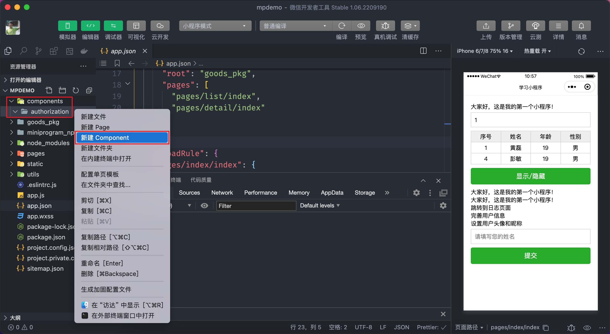
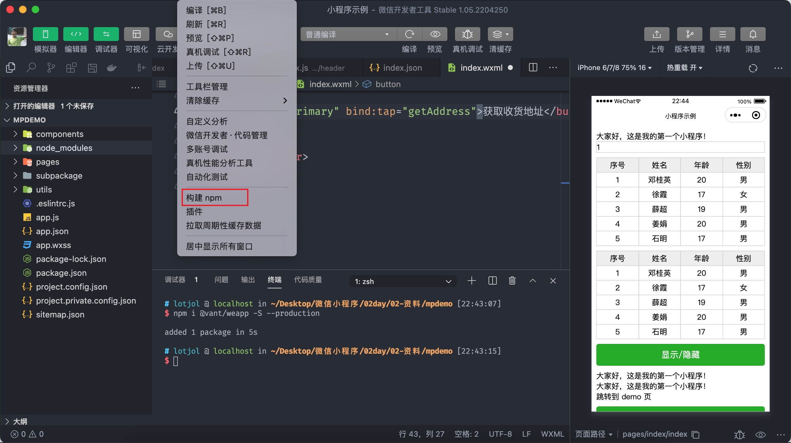

# 自定义组件

小程序有许多的[内置组件](https://developers.weixin.qq.com/miniprogram/dev/component/)，比如之前学习过的 `view`、`image`、`scroll-view`、`swiper`等，除此之外小程序也允许开发者自定义组件。

## 5.1 组件基础

自定义组件的结构与页面是一致的，即也包含有4个部分，分别为:

- `.wxml` 组件的布局结构
- `.js` 组件的处理逻辑
- `.json` 组件的配置文件
- `.wxss` 组件的布局样式

### 5.1.1 创建组件

通常习惯将组件放到独立的目录 `components` 当中，这个目录需要我们手动进行创建。

创建一个叫 `authorization` 的组件来学习组件创建的步骤，在 `components` 目录中新建 `authorization` 目录，然后在右键在菜单中找到【新建 Component】，输入**组件名称**后会自动创建组件。



组件和页面的结构是一致的，但也是有区别的，先简单有个了解：

- 组件的配置文件中配置项 `component: true`
- 组件的 `.js` 文件中调用 `Component` 函数

### 5.1.2 注册组件

组件的注册分为页面注册和全局注册两种情况：

页面注册是在使用组件的页面配置中通过 `usingComponents` 进行注册，只能在当前页面中使用注册的组件，如下代码所示：

```json
{
  "usingComponents": {
    "authorization": "/components/authorization/index"
  }
}
```

```xml
<!-- pages/index/index.wxml -->
<!-- 双标签用法 -->
<authorization></authorization>
<!-- 单标签用法(一定要闭合) -->
<authorization />
```

全局注册是在 `app.json` 文件中通过 `usingComponents` 对自定义组件进行注册，注册的组件可以任意页面中使用全局注册的组件，如下代码所示：

```json{4-6}
{
  "pages": [...],
  "window": {...},
  "usingComponents": {
    "authorization": "/components/authorization/index"
  },
  "sitemapLocation": "sitemap.json"
}
```

以上示例重点演示了组件的创建及注册步骤，组件功能并不同我们的重心，因此关于组件的布局结构、样式以并未详细展开，不过关于布局和样式部分和页面并没有太大的差别，同学们课下自行练习一下。

## 5.2 组件进阶

本节来学习如何处理组件的逻辑。

### 5.2.1 数据与方法

组件的数据由两部分构成：

- `data` 组件本身内部定义的数据
- `properties` 通过组件属性从外部传入组件内部的数据（类似 Vue 的 props）

```javascript
// components/authorization/index
Component({
  // 初始组件内部数据
  data: {
    message: '组件中初始的数据'
  },
  // 定义组件的属性，接收外部传入的数据
  properties: {
    isLogin: {
      type: Boolean,
      value: true,
    },
    tips: Array,
  },
})
```

上述代码中 `properties` 中定义了两个属性分别为 `isLogin` 和 `tips`，在应用组件时传入数据：

```xml
<authorization is-login="{{false}}" tips="用户未登录"></authorization>
```

::: tip 提示
应用组件属性名采用 kebab-case 命名法，即 `is-login` 这种形式，而在组件定义 `properties` 时采用的是小驼峰命名法，即 `isLogin`。
:::

查看或调试传入组件的数据与页面数据的查看方式不同，具体查看如下图所示：


### 5.2.2 生命周期和方法

前面我们分别学习了应用级别和页面级别的生命周期，组件也有生命周期函数，通过 `lifetimes` 来定义，主要的生命周期函数有：

- `create` 组件实例刚刚被创建好时，`created` 生命周期被触发，该生命周期中无法调用 `setData`，一般为组件添加一些自定义属性字段。

- `attached` 在组件完全初始化完毕、进入页面节点树后，`attached` 生命周期被触发。

```javascript{15-25}
// components/authorization/index.js
Component({
  data: {
    message: '组件中初始的数据',
  },
  properties: {
    isLogin: {
      type: Boolean,
      value: true,
    },
    tips: String,
  },

  // 组件生命周期
  lifetimes: {
    created() {
      // this.setData({message: '此时不能调用 setData'})
      // 为当前组件实例自定义属性 author
      this.author = 'itcast';
    },
    attached() {
      // 没有什么限制了，可以执行任意的操作
      this.setData({ message: '组件进入到页面节点了...' });
    },
  },
});
```

为了帮助大家理解可以对照 `Vue` 来学习，`create` 与 `Vue` 组件的 `create` 比较接近，`attached` 与 `Vue` 组件中的 `mounted` 比较类似，在处理一般情的逻辑时 `attached` 使用较多一些。

接下来学习如何在组件中定义方法，在组件中定义方法与页面也有所不同，组件中的方法必须要定义在 `methods` 属性当中：

```javascript{11-14,18-24}
// components/authorization/index.js
Component({
  data: {
    message: '组件中初始的数据',
  },
  properties: {...},
  // 组件生命周期
  lifetimes: {
    created() {...},
    attached() {
      // 检测用户登录状态
      const isLogin = this.checkLogin();
      // 更新渲染
      this.setData({ isLogin });
    },
  },

  methods: {
    // 假设有个方法用于检测登录
    checkLogin() {
      // 读取本地存储的数据
      return !!wx.getStorageSync('token');
    },
  },
});
```

## 5.3 Vant 组件

Vant 提供了微信小程序版本的[组件库](https://vant-contrib.gitee.io/vant-weapp/#/home)，它本质上就是自定义的小程序组件，我们来学习如何在小程序中引入 Vant 组件库。

第 1 步：安装 vant 组件库

```bash
npm i @vant/weapp -S --production
```

第 2 步：如下图所示构建 Vant 组件库，构建时会去检查 `package.json` 中记录的依赖，因此务必何证 `package.json` 文件的存在。



第 3 步：以按钮组件为例，演示使用 Vant 组件的使用方法，推荐全局注册组件 Vant 组件

```json
{
  "usingComponents": {
    "van-button": "@vant/weapp/button/index"
  }
}
```

在使用 Vant 组件时需要将小程序全局配置中的 `style` 去掉：


