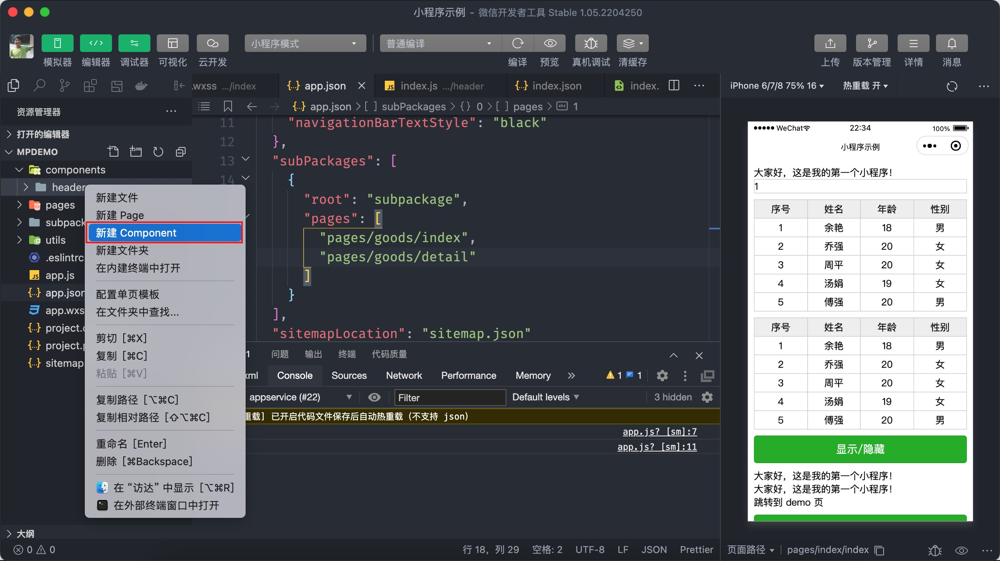

# 自定义组件

小程序中提供了许多的[内置组件](https://developers.weixin.qq.com/miniprogram/dev/component/)，比如之前学习过的 `view`、`image`、`scroll-view`、`swiper`等，除此之外小程序也允许开发者自定义组件。

## 5.1 自定义组件

小程序中自定义组件的内容还是比较多的，不过在这里我并不展开讲解，主要来了解一下其语法：

自定义组件分成两步：

### 5.1.1 创建组件

通常习惯将组件放到独立的目录 `components` 当中，这个目录需要我们手动进行创建，然后右键在菜单中找到【新建 Component】，输入**组件名称**后会自动创建组件，组件也是分别由 `.wxml`、`.wxss`、`.js`、`.json` 构成。



对比创建好的自定义组件和页面的区别时有两点需要注意：

- 组件的配置文件中必须要设置 `component: true`

```json
{
  "component": true
}
```

- 组件的 `.ts` 文件中调用的不是 `Page` 而是 `Component` 函数

```typescript
Component({
  // ...code
})
```

### 5.1.2 注册组件

组件的注册分为页面注册和全局注册两种情况：

页面注册是在使用组件的页面配置中通过 `usingComponents` 进行注册，只能在当前页面中使用注册的组件，如下代码所示：

```json
{
  "usingComponents": {
    "my-header": "/components/header/index"
  }
}
```

```xml
<!-- pages/index/index.wxml -->
<!-- 双标签 -->
<header></header>
<!-- 单标签，必须要自闭合 -->
<header />
```

全局注册是在 `app.json` 文件中通过 `usingComponents` 对自定义组件进行注册，注册的组件可以任意页面中使用全局注册的组件，如下代码所示：

```json{14-16}
{
  "pages": [
    "pages/index/index",
    "pages/logs/logs",
    "pages/profile/index",
    "pages/storage/index"
  ],
  "window": {
    "backgroundTextStyle": "light",
    "navigationBarBackgroundColor": "#fff",
    "navigationBarTitleText": "学习小程序",
    "navigationBarTextStyle": "black"
  },
  "usingComponents": {
    "my-header": "/components/header/index"
  },
  "style": "v2",
  "sitemapLocation": "sitemap.json"
}
```

## 5.2 Vant 组件

Vant 提供了微信小程序的[组件库](https://vant-contrib.gitee.io/vant-weapp/#/home)，它本质上就是自定义的小程序组件，我来给大家介绍一下如何引入 Vant 组件库。

第 1 步：安装 vant 组件库

```bash
npm i @vant/weapp -S --production
```

第 2 步：构建 npm 模块，会自动创建 `miniprogram_npm` 目录，存放构建好的代码

由于 node_modules 目录没有位于 miniprogram 目录当中，因此在进行构建时需要修改配置文件 project.config.json

```json{3,5-11}
{
  ...
  "setting": {
    ...
    "packNpmManually": true,
    "packNpmRelationList": [
      {
        "packageJsonPath": "./package.json",
        "miniprogramNpmDistDir": "./miniprogram/"
      }
    ]
  }
}
```


第 3 步：配置 `usingComponents`

```json
{
  "usingComponents": {
    "van-button": "@vant/weapp/button/index"
  }
}
```

在使用 Vant 组件时需要将小程序全局配置中的 `style` 去掉：

```json

```


