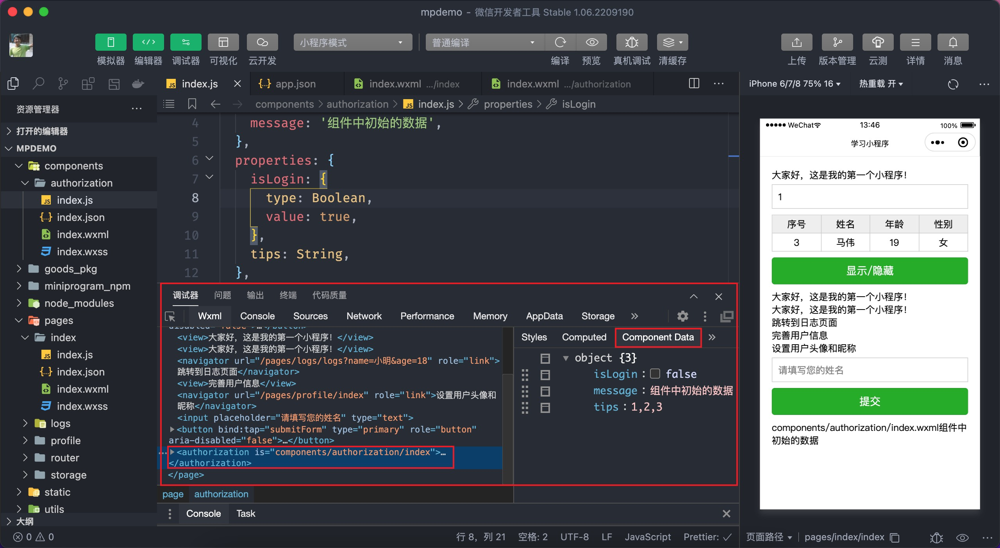

# 小程序进阶

小程序中提供了许多的[内置组件](https://developers.weixin.qq.com/miniprogram/dev/component/)，比如之前学习过的 `view`、`image`、`scroll-view`、`swiper`等，不仅如此小程序也允许开发者自定义组件。

## 5.1 自定义组件

小程序中自定义组件的内容还是比较多的，不过在这里我并不展开讲解，主要来了解一下其语法：

自定义组件分成两步：

1. 定义组件

通常习惯将组件放到独立的文件夹 `components` 目录当中，这个目录需要我们手动进行创建，然后右键在菜单中找到【新建 Component】，输入组件名称后会自动创建组件，组件也是分别由 `.wxml`、`.wxss`、`.js`、`.json` 构成。


但是有两点需要注意：

- 组件的配置文件中必须要设置 `component: true`

```json
{
  component: true
}
```

- 组件的 `.js` 文件中调用的不是 `Page` 而是 `Component` 函数

```javascript
Component({
  // ...code
})
```

1. 导入组件

导入组件也就是要使用组件，首先要在使用组件的页面配置 `usingComponents` 相当于 Vue 中的注册组件

```json
{
  "usingComponents": {
    "my-header": "/components/header/index"
  }
}
```

导入组件成功后就可以在相应的页面中以“标签”的形式使用了。

```xml
<!-- 双标签 -->
<header></header>
<!-- 单标签，必须要自闭合 -->
<header />
```

## 5.2 Vant 组件

Vant 提供了微信小程序的[组件库](https://vant-contrib.gitee.io/vant-weapp/#/home)，它本质上就是自定义的小程序组件，我来给大家介绍一下如何引入 Vant 组件库。

第1步：安装 vant 组件库

```bash
npm i @vant/weapp -S --production
```

第2步：构建 npm 模块，会自动创建 `miniprogram_npm` 目录，存放构建好的代码



第3步：配置 `usingComponents` 

```json
{
  "usingComponents": {
    "van-button": "@vant/weapp/button/index"
  }
}
```


