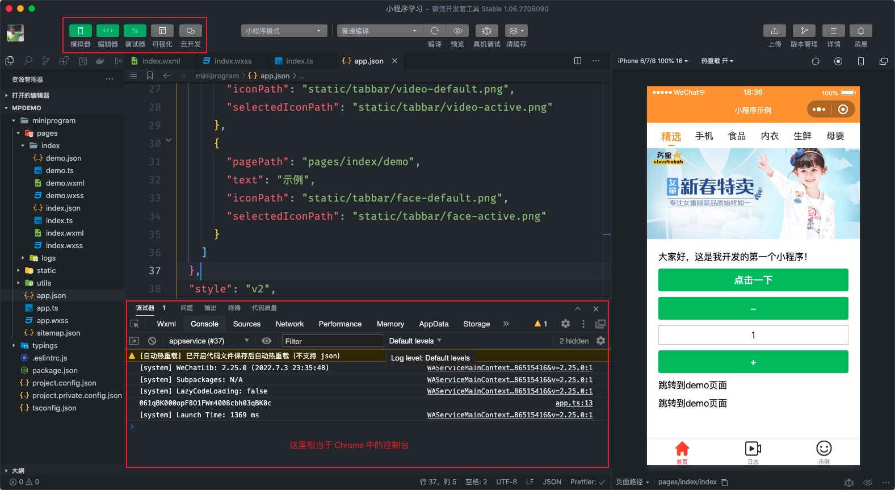
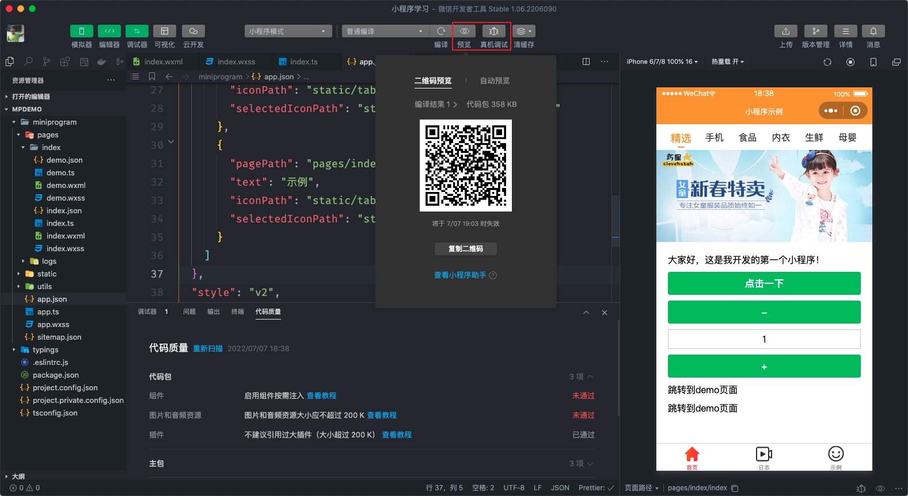
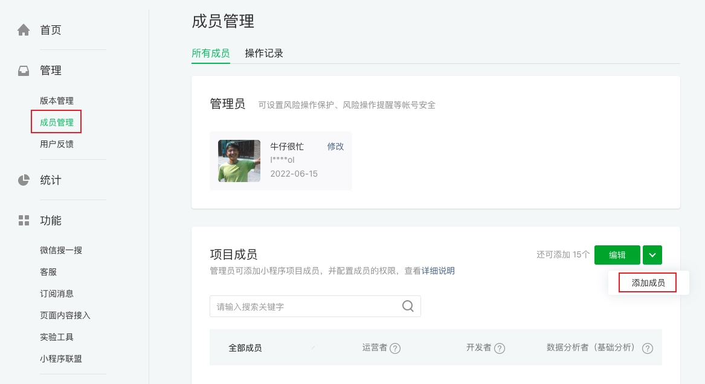
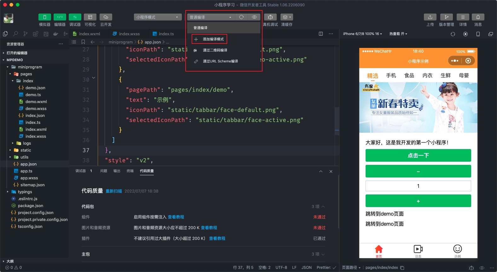
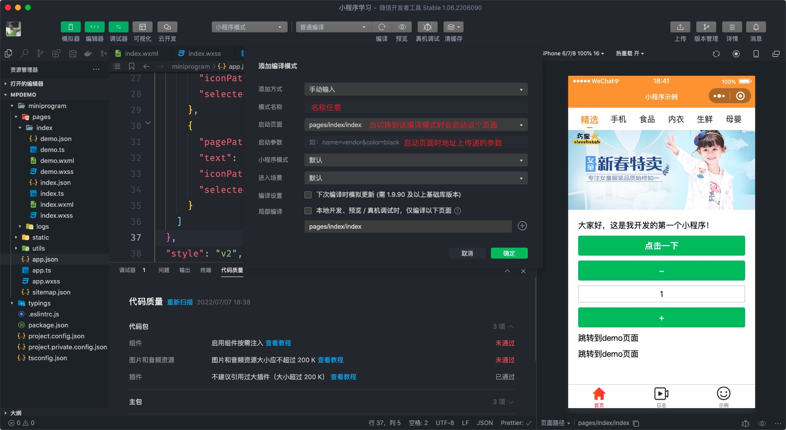

# 小程序调试

任何程序开发都离不开调试，小程序开发者工具自带了调试工具，下面我们就来学习小程序开发者工具的调试功能。

## 3.1 调试器

上图中的 【Wxml】 是用来显示小程序页面的结构和样式，【Console】 控制台，【Network】 查看网络请求，【AppData】 查看组件本地数据，【终端】创建命令行窗口等。

## 3.2 预览和真机调试

在大部情况下我们编写的代码会在开发者工具的模拟器中查看到效果，不仅如此开发者工具还允许我们在真机中进行预览或调试，实现这个功能非常简单，如下图所示：

如上图所示点击预览或者真机调试等待片刻会出现一个二维码，**此时只有管理员或指定的开发成员才可以扫码查看**，如果点击的是真机调试时还会自动打开一个调试面板对真机上的小程序进行调试（详细见课堂演示）。

这里有个问题，指定的开发成员是什么意思呢？

开发成员就是一个团队共同开发同一个小程序的情形，在小程序管理后台可以添加开发成员，添加了开发成员后大家就可以使用同一个 AppID 开发同一个小程序了，我们还学习一下如何添加开发成员，[登录小程序管理后台](https://mp.weixin.qq.com/)，找到【成员管理】，如下图：

以上图中的步骤根据引导通过【微信号】添加成员即可，大家可以互想添加成员测试一下该功能的应用。

## 3.3 编译模式

编译模式是允许开发者为某个页面指定编译模式来进行调试，当前我们先有个简单的了解，使用的步骤如下：

这个功能我们暂时还用不到，大家先有个了解即可。

## 3.4 刷新和热重载

早期小程序开发者工具是没有刷新的功能，只有编译功能，即每次修改代码后都会将页面重新编译，这种情况下开发效率比较低，现在的小程序开发工具中支持了刷新和热重载的功能。

注：热重载的功能不针对 `.json` 文件生效，即改动 `.json` 文件后小程序项目会重新被编译。
