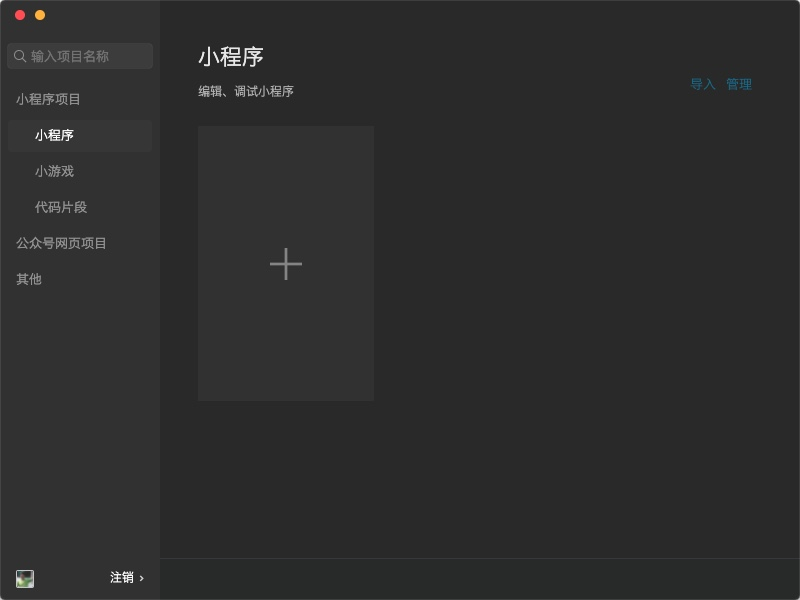
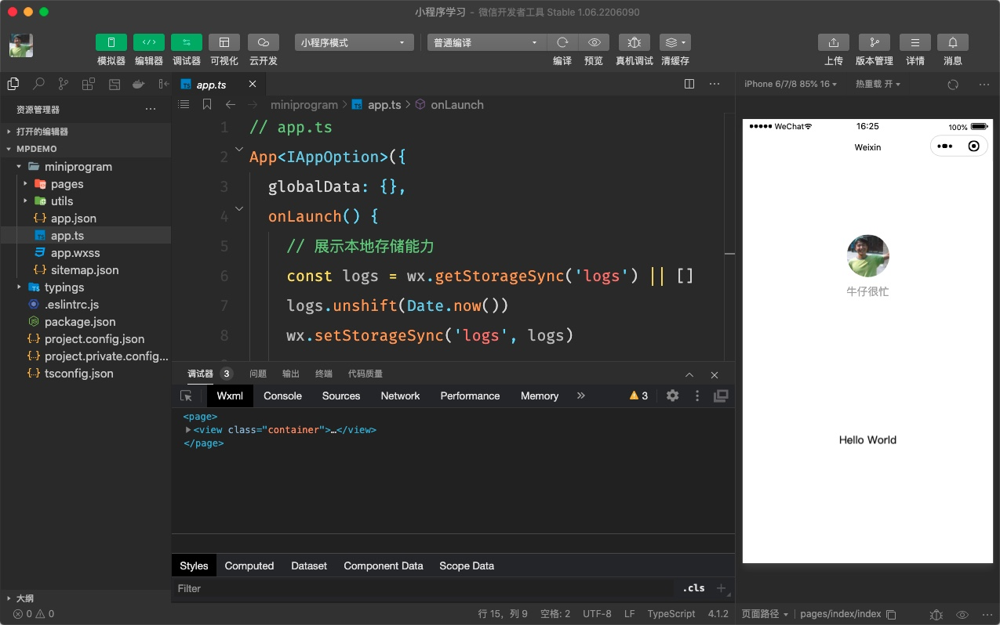
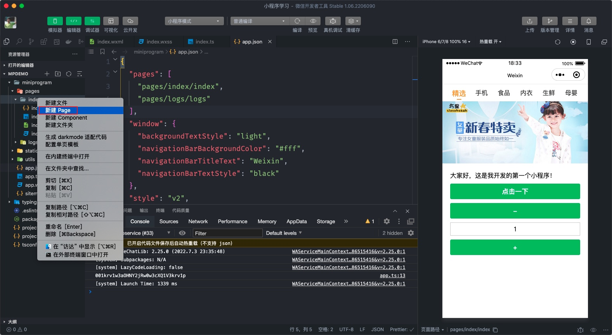
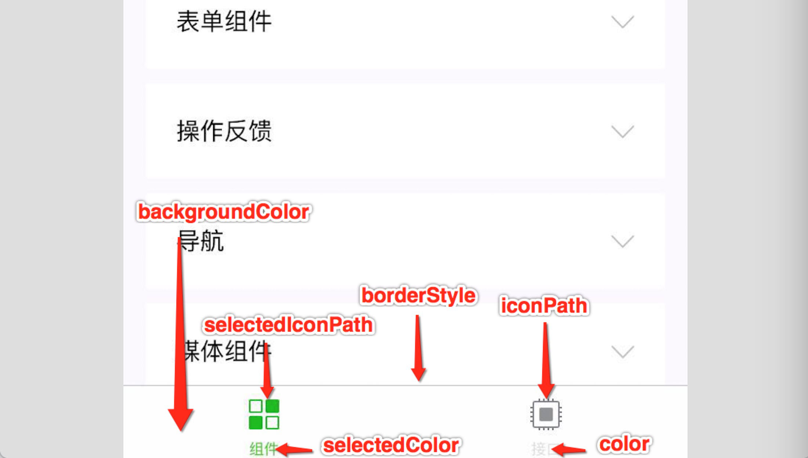

# 小程序开发

小程序开发的模式与Web非常类似，除了使用 Javascript 语言外，还有类似于 html、css 的新技术 wxml 和 wxss，分别用于实现小程序页面的布局及样式。

## 2.1 创建小程序

通过小程序开发者工具创建一个新的项目，步骤如下图所示：

1. 点击 + 号，新建项目
   
   

2. 填写项目信息
   
   

3. 启动小程序项目



## 2.2 目录结构

成功创建小程序项目后会初始小程序的目录结构（一些文件和目录），我们先来了解一下这些文件和目录的作用，这对于我们学习小程序开发非常有帮助。

我们将从两个方面入手来介绍小程序的目录结构：文件类型和特定名称的文件

先来看文件类型，小程序主要提供了 4 种文件类型：

| 类型名称 | 作用                                          | 是否必须存在 |
| -------- | --------------------------------------------- | ------------ |
| .wxml    | 小程序页面的布局结构，相当于网页中 .html 文件 | 是           |
| .wxss    | 小程序页面的样式，相当于网页中的 .css 文件    | 否           |
| .ts      | 小程序页面的逻辑                              | 是           |
| .json    | 小程序页面的配置                              | 否           |

我们了解的是小程序的每个页面都是由以前文件类型的文件共同构成的。`四个文件必须是相同的名字和路径`

再来看一些**特定名称**的文件：

| 文件名              | 作用                         | 是否必须存在     |
| ------------------- | ---------------------------- | ---------------- |
| app.ts              | 小程序入口（首先执行的文件） | 是               |
| app.json            | 小程序的**全局**配置         | 是               |
| app.wxss            | 小程序的**全局**样式         | 否               |
| project.config.json | 小程序**开发者工具**配置     | 是（会自动创建） |
| sitemap.json        | 小程序搜索优化               | 否               |

以上关于文件类型及特定文件相关的细节，后续学习过程中会逐步讲解，在此只是先对目结构有个大致的了解！

## 2.3 牛刀小试

在对小程序目录结构有了简单了解后再结合之前所学的网页的相关知识简单修改部分代码来看看效果，修改的需求为：将小程序页面中的文字颜色变成红色，字号变成 20px。

通过上面的讲解我们知道 .wxml 是用来定义页面内容及结构的，所以我们先从 .wxml 入手，打开 `pages/index/index.wxml` 找到如下代码：

```xml
<!-- 第 20 ~ 22 行 -->
<view class="usermotto">
  <text class="user-motto">{{motto}}</text>
</view>
```

在此基础上改变一些内容（加了几个感叹号），保存代码后，页面中立刻发生了变化（刷新）

```xml
<!-- 第 20 ~ 22 行 -->
<view class="usermotto" style="aaaa">
  <text class="user-motto">{{motto}}!!!</text>
</view>
```

通过这一步操作体会一下 .wxml 类型的文件相当于 html 用来定义页面中的内容和结构。

接下来打开 `pages/index/index.wxss`，找到 `.usermotto` 这个选择器，如下代码所示：

```css
/* 第 17 ~ 19 行 */
.usermotto {
  margin-top: 200px;
}
```

在此基础上修改一些样式，设置字号及颜色，保存代码后，页面也会立刻发生变化（刷新）

```css
.usermotto {
  font-size: 20px;
  color: red;
  margin-top: 200px;
}
```

通过这一步操作体会一下 .wxss 类型的文件相当于 css 用来定义页面样式，并且似乎（事件也是这样的）和 css 的属性也都是一样的！

至于 .ts 和 .json 等其它内容我们后面会有专门的章节进行讲解。

## 2.4 实现页面导航布局

通过一个小案例来学习小程序页面布局的相关知识，主要涉及到小程序内置的组件（标签）用样式的使用。

如下图所示是比较常见的顶部页面导航的布局，要实这个布局会用于小程序中提供的一些组件（标签）如下表所示：

| 组件名（标签） | 作用             | 与 html 对比               |
| -------------- | ---------------- | -------------------------- |
| view           | 定义一个块级元素 | 相当于 html 中的 div 标签  |
| text           | 定义一个行内元素 | 相当于 html 中的 span 标签 |

关于小程序中的样式几乎和网页的 css 是一样的，先学习部分选择器的使用，如下表所示：

| 选择器     | 示例       | 含义                       |
| ---------- | ---------- | -------------------------- |
| 类选择器   | .navs      | 根据类名选择元素           |
| 标签选择器 | text、view | 根据标签名选择元素         |
| 后代选择器 | .navs text | 根据标签的嵌套关系选择元素 |

我们暂时在 `pages/index/index.wxml` 和 `pages/index/index.wxss` 中编写代码（将原来的示例代码先全选删除）

完整代码如下所示：

```xml
<!-- pages/index/index.wxml -->
<view class="navs">
  <text class="active">精选</text>
  <text>手机</text>
  <text>食品</text>
  <text>内衣</text>
  <text>生鲜</text>
  <text>母婴</text>
</view>
```

```css
/* pages/index/index.wxss */
.navs {
  display: flex;
  justify-content: space-evenly;
  height: 44px;
  padding: 0 10px;
  line-height: 44px;
  border-top: 1px solid #eee;
  /* background-color: pink; */
}

.navs text {
  width: 50px;
  text-align: center;
  color: #333;
}

.navs .active {
  color: #f5a11c;
  font-size: 18px;
  position: relative;
  top: 2px;
}

.navs .active::after {
  content: "";
  position: absolute;
  left: 50%;
  bottom: 6px;
  height: 2px;
  width: 12px;
  transform: translate(-50%);
  border-radius: 2px;
  background-color: #f5a11c;
}
```

通过上述的小例子大家要体会在编写小程序页面时与网页布局几乎是一致的，所不同的就是小程序中使用了一些特定的组件（组件），关于样式部分和 css 几乎完全一致。

另外大家有没有发现样式文件不需要引入到页面当中，它是自动引入并生效的，但是要求**页面文件的名称和样式的文件必须要一致！**

## 2.5 小程序适配

小程序大部情况下是运行在手机端的它也需要像移动Web一样来处理不同大小屏幕的适配，小程序中适配的方法非常简单，它提供了专门的单位 `rpx` 它会自动的根据屏幕的大小转换成 `px` 。

详细见课堂演示。

实际应用的过程中设计稿的尺寸都是【以 `750px` 做为基准】，我们只需要将设计稿中看到的单位写成相应的 `rpx` 即可。

## 2.6 实现轮播图交互

为了让大家对小程序内置组件有更多的了解，我们再来看几个功能强大的组件：

| 组件名（标签） | 作用                                 | 与 html 对比        |
| -------------- | ------------------------------------ | ------------------- |
| swiper         | 滑块视图容器                         | 无                  |
| swiper-item    | 可滑动的区块（必须用在 swiper 内部） | 无                  |
| image          | 图片                                 | img（注意名称区别） |

swiper 的强大之处在于它允许通过属性的方式对轮播图进行配置，常见的属性包括：

| 属性名                                                                                 | 默认值            | 作用                 |
| -------------------------------------------------------------------------------------- | ----------------- | -------------------- |
| indicator-dots                                                                         | false             | 是否显示面板指示点   |
| autoplay                                                                               | false             | 是否自动切换         |
| circular                                                                               | false             | 是否采用衔接滑动     |
| indicator-color                                                                        | rgba(0, 0, 0, .3) | 指示点颜色           |
| indicator-active-color                                                                 | \#000000          | 当前选中的指示点颜色 |
| ... 还有[更多](https://developers.weixin.qq.com/miniprogram/dev/component/swiper.html) |                   |                      |

swiper 的功能强大提供的属性非常多，不过不用头疼，常用的就几个以后根据开发需求随用随查就可以了。

## 2.7 购物车计数器

有了小程序布局相关知识后我们来进一步学习一下小程序中如何处理逻辑，如数据渲染和事件处理等，我们通过实现购物车计数器功能为例展开学习。

打开 `pages/index/index.ts` 将原来的全部内容都删除掉，我们一点点添加代码。

在动手前最先要了解的是每个页面的 .js 文件中**必须调用**一个内置全局的函数 `Page` 并且至少要传入一个**空对象**做为它的参数，否则可能会报错，如下图所示：



Page 函数的配置项及其含义：

| 选项 | 含义             | 说明                      |
| ---- | ---------------- | ------------------------- |
| data | 定义页面初始数据 | 类似 vue 组件的 data 函数 |

在了解了上述的知识后，我们看看相关的代码实现一下：

```javascript
// pages/index/index.ts
Page({
  data: {
    msg: '大家好，这是我开发的第一个小程序！'
  }
})
```

上述代码中为 `pages/index/index.wxml` 初始了一个数据 `msg`，那如何才能将它渲染到页面当中呢？非常简单通过插值（ 即{{}} ）可以将 `msg` 渲染到指定的页面位置：

```xml
<!-- pages/index/index.wxml -->
<!-- 上一小节页面导航和轮播图代码省略了... -->
<!-- 添加的新代码 -->
<view>{{msg}}</view>
```

保存代码后就可以在页面中看到 "大家好，这是我开发的第一个小程序！" 这段文字了。 

大家自行尝试一下数据据型如果是 数组或对象时如何渲染到页面当中？例如：

```javascript
// pages/index/index.ts
Page({
  data: {
    msg: '大家好，这是我开发的第一个小程序！',
    // 初始对象类型的数据
    user: {
      name: '小明',
      age: 18
    }
  }
})
```

揭晓答案：其实也非常简单跟 Vue 的语法一样，直接通过 “.” 语法就可以了。

这时告诉大家一个“小秘密”，我们不需要在 wxml 导入 `.ts` 文件，只要保证 `.ts` 文件名称与页面的文件名称保持一致就可以了（是不是在哪里听到过类似的情况）。

在对 `data` 的知识有了一个了解之后，如何定义方法来充当事件的回调函数，在开始之前介绍一下如何添加事件监听及对初始数据进行修改：

1. 事件监听

小程序中绑定事件的语法为 【bind事件名="事件回调"】 和 【bind:事件名="事件回调"】 两种形式，小程序中大部分事件类型与网页中一致，有个特殊的事件类型需要指出，小程序中没有 `click` 事件类型，取而代之的是 `tap` 事件。

```xml
<!-- page/index/index.wxml -->
<!-- 省略前面几小节的代码 -->
<button bind:tap="sayHi">点击一下</button>
```

上述代码中的 `button` 也是小程序中内置组件，通过 `bind:tap="sayHi"` 添加点击事件的监听，sayHi 是一个方法会在点击按钮时被调用，那这个方法我们定义了吗？

在Vue 中是通过 methods 选项来定义方法，然而在小程序的页面中直接定义一个方法就可以了，这一点和 Vue 不一样大家一定要注意，来看具体的用法：

```javascript
// pages/index/index.ts
Page({
  data: {
    msg: '大家好，这是我开发的第一个小程序！'
  },
  sayHi() {
    console.log('按钮被点击了...')
  }
})
```

以上就是小程序中的事件处理方法了，你学会了吗？

2. 更新数据

 据我们的经验可以知道 data 中的数据应该是可以根据逻辑的需要进行修改的，那我们就来学习一下小程序中如何修改这些数据吧，假如用户在点击的时候我们将 msg 这个数据修改为 "Hello everybody，this is my first miniprogram!"，如何实现呢？

```javascript
// pages/index/index.ts
Page({
  data: {
    msg: '大家好，这是我开发的第一个小程序！'
  },
  
  sayHi() {
    console.log('按钮被点击了...')
    // 错误的写法！
    // this.msg = 'Hello everybody，this is my first miniprogram!'
    // 正确的写法
    this.setData({
      msg: 'Hello everybody，this is my first miniprogram!'
    })
  }
})
```

这里要敲黑板了，注意小程序中修改数据不是直接进行赋值，而是通过调用 `this.setData()` 方法来实现的。

好了基础知识铺垫完了，接下来我们就可以实现购物车计数器的功能了：

1. 简单布局一下页面，用到两个按钮组件和一个输入框组件
2. 监听按钮的点击事件，然后对数值进行加1或减1操作
3. 将按钮修改后的结果显示在输入框组件中

```javascript
// pages/index/index.ts
Page({
  data: {
    msg: '大家好，这是我开发的第一个小程序！',
    // 初始值为 1
    num: 1
  },
  sayHi() {
    // 省略...
  },
  // 购物车数量加1
  increment() {
    // 数量最小为1
    if(this.data.number <= 1) return;
    this.setData({
      num: this.data.num + 1
    })
  },

  // 购物车数量减1
  decrement() {
    num: this.data.num - 1
  }
})
```

```xml
<!-- pages/index/index.wxml -->
<!-- 上一小节页面导航和轮播图代码省略了... -->
<button type="primary" bind:tap="increment">-</button>
<input value="{{num}}" />
<button type="primary" bind:tap="decrement">+</button>
```

上述代码中中两个补充的知识，大家一定要注意：

- 为组件的属性绑定数据时也必须使用 `{{}}` ，这一点与 Vue 是不同的
- 读取 data 中的数据通过 `this.data.xxx` 这一点与 Vue 也是不相同的

## 2.8 小程序配置

前面我们简单介绍了一下 `.json` 类型的文件是用来对小程序进行配置的，如窗口的颜色、标题、自定义组件、底部tab栏等都是通过配置文件来实现的。配置文件又分为全局配置 `app.json` 和页面里的配置，我们先来看全局的配置：

首先要知道配置文件最外层是一个对象，我们再来看一些常见的配置：

| 配置项        | 类型     | 是否必须 | 说明                |
| ------------- | -------- | -------- | ------------------- |
| pages         | string[] | 是       | 页面路径列表        |
| window        | object   | 否       | 全局的默认窗口表现  |
| tabBar        | object   | 否       | 底部 `tab` 栏的表现 |
| entryPagePath | string   | 否       | 小程序默认启动首页  |

1. pages 的值是一个数组，在这个数组中将所有页面的路径写在这里，**否则页面无法被访问到**，默认数组的第一个单元为小程序的启动首页。

```json
{
  "pages": [
    "pages/index/index",
    "pages/logs/logs"
  ]
}
```

下面我们**新建一个页面**来测试 pages 配置项的使用：


在任意文件夹上右键，然后在弹出的菜单中选择【新建Page】，然后输入页面名称（如：demo）然后敲回车，此时便会创建出4个文件来，分别为 `demo.wxml`、`demo.ts`、`demo.wxss`、`demo.json`，这 4 个文件正好是一个完整页面的构成，**不仅如此配置文件 app.json 当中也自动的将这个新建的页面路径**。



那 pages 的作用到底是什么呢？如果没有在 pages 中添加这个页面又会出现什么结果呢？下面我们来通过链接跳转的方式来给大家演示一下效果：

| 组件名    | 作用     | 与 htm对比              |
| --------- | -------- | ----------------------- |
| navigator | 地址跳转 | 相当于 html 中的 a 标签 |

在`pages/index/index`页面中添加一个链接并跳转到刚刚创建的 demo 页面

```xml
<!-- pages/index/index.wxml -->
<!-- 省略前几小节代码 -->
<!-- 相对路径 -->
<navigator url="./demo">跳转到 demo 页面</navigator>
<!-- 绝对路径 -->
<navigator url="/pages/index/demo">跳转到 demo 页面</navigator>
<!-- 注意如果 url 地址为空的，小程序会报一个找不到路径的错误（不影响其它功能） -->
```

上述两种情况都可以正常的跳转到 demo 页面，但是如果将 `app.json` 中的 demo 页面路径删除后，则不能成功跳转了（点击跳转链接后没有任何反应），所以我们必须要把页面的路径填写到 `pages` 的配置项中。

1. window 的值是一个对象，通过它可以全局配置小程序的状态栏、导航条、标题、窗口背景色。

| 属性                                                                                                     | 类型       | 默认值  | 说明                                     |
| -------------------------------------------------------------------------------------------------------- | ---------- | ------- | ---------------------------------------- |
| navigationBarTitleText                                                                                   | string     | 空白    | 导航栏标题文字内容                       |
| navigationBarTextStyle                                                                                   | string     | black   | 导航栏标题颜色，仅支持 `black` / `white` |
| navigationBarBackgroundColor                                                                             | 16进制颜色 | #00000  | 导航栏背景颜色，如 `#000000`             |
| navigationStyle                                                                                          | string     | default | 导航栏样式，仅支持 `default` / `custom`  |
| enablePullDownRefresh                                                                                    | boolean    | false   | 是否开启全局的下拉刷新                   |
| ... 还有[更多](https://developers.weixin.qq.com/miniprogram/dev/reference/configuration/app.html#window) |            |         |                                          |

```json
{
  "pages": [
    "pages/index/index",
    "pages/logs/logs",
    "pages/demo/demo"
  ],
  "window": {
    "navigationBarTitleText": "小程序示例",
    "navigationBarTextStyle": "white",
    "navigationBarBackgroundColor": "#f5a11c",
    "enablePullDownRefresh": true
  }
}
```

3. tabBar 定义小程序 tab 栏的表现，如下图即所谓的 tab 栏：

 

定义tab 的内容有些多，大家参照着上图和下面的表格来对小程序的 tab 栏进行配置：

| 属性            | 类型       | 默认值 | 是否必须 | 说明                                                       |
| --------------- | ---------- | ------ | -------- | ---------------------------------------------------------- |
| list            | array      | 无     | 是       | tab 的列表，详见 `list` 属性说明，最少 2 个、最多 5 个 tab |
| color           | 16进制颜色 | 无     | 否       | tab 上的文字默认颜色，仅支持十六进制颜色                   |
| selectedColor   | 16进制颜色 | 无     | 否       | tab 上的文字选中时的颜色，仅支持十六进制颜色               |
| backgroundColor | 16进制颜色 | 无     | 否       | tab 的背景色，仅只持16进制颜色                             |
| borderStyle     | string     | black  | 否       | tabbar 上边框的颜色， 仅支持 `black` / `white`             |
| position        | string     | bottom | 否       | tabBar 的位置，仅支持 `bottom` / `top`                     |

上述配置中 `list` 具体又包含以下内容：

| 属性             | 类型   | 默认值 | 是否必须 | 说明                                                                                                                   |
| ---------------- | ------ | ------ | -------- | ---------------------------------------------------------------------------------------------------------------------- |
| pagePath         | string |        | 是       | 页面路径，必须在 pages 中先定义                                                                                        |
| text             | string |        | 是       | tab 上按钮文字                                                                                                         |
| iconPath         | string |        | 否       | 图片路径，icon 大小限制为 40kb，建议尺寸为 81px * 81px，不支持网络图片，当 `position` 为 `top` 时，不显示 icon         |
| selectedIconPath | string |        | 否       | 选中时的图片路径，icon 大小限制为 40kb，建议尺寸为 81px * 81px，不支持网络图片，当 `position` 为 `top` 时，不显示 icon |

以上的配置不用刻意的去背，根据需要随时查询就可以，以下为示例代码：

```json
{
  "pages": [
    "pages/index/index",
    "pages/logs/logs",
    "pages/demo/demo"
  ],
  "window": {
    "navigationBarTitleText": "小程序示例",
    "navigationBarTextStyle": "white",
    "navigationBarBackgroundColor": "#f5a11c",
    "enablePullDownRefresh": true
  },
  "tabBar": {
    "color": "#999",
    "selectedColor": "#e93b3d",
    "backgroundColor": "#fff",
    "list": [
      {
        "pagePath": "pages/index/index",
        "text": "首页",
        "iconPath": "static/tabbar/home-default.png",
        "selectedIconPath": "static/tabbar/home-active.png"
      },
      {
        "pagePath": "pages/logs/logs",
        "text": "日志",
        "iconPath": "static/tabbar/video-default.png",
        "selectedIconPath": "static/tabbar/video-active.png"
      },
      {
        "pagePath": "pages/index/demo",
        "text": "示例",
        "iconPath": "static/tabbar/face-default.png",
        "selectedIconPath": "static/tabbar/face-active.png"
      }
    ]
  }
}
```

演练：自已添加一个新的 Tab

以上是常用的全局配置项，还有更多[全局配置](https://developers.weixin.qq.com/miniprogram/dev/reference/configuration/app.html)的选项，后续学习当中会根据需要进行讲解。

那接下来咱们再来学习一下**页面配置**，顾名思义页面配置只针对某个页面生效，如 `index.json` 是针对 index 页面生效，`demo.json` 是针对页面 demo 生效，页面的部分配置可以覆盖全局 `app.json` 中的配置，常见的配置如下表：

| 属性                         | 类型       | 默认值  | 是否必须 | 说明                                     |
| ---------------------------- | ---------- | ------- | -------- | ---------------------------------------- |
| navigationBarTitleText       | string     | 空白    | 否       | 导航栏标题文字内容                       |
| navigationBarTextStyle       | string     | black   | 否       | 导航栏标题颜色，仅支持 `black` / `white` |
| navigationBarBackgroundColor | 16进制颜色 | #00000  | 否       | 导航栏背景颜色，如 `#000000`             |
| navigationStyle              | string     | default | 否       | 导航栏样式，仅支持 `default` / `custom`  |
| enablePullDownRefresh        | boolean    | false   | 否       | 是否开启全局的下拉刷新                   |

有没有发现上表中的配置内容其实是全局配置中 `window` 部分的内容，写在 `app.json` 中的属于全局配置对所有的页面都生效，而写在页面中的只对当前页面生效，并且会覆盖全局的同名的配置，下面代码是 demo 页面即 `demo.json` 中的配置：

```json
{
  navigationBarBackgroundColor: '#ff0',
  enablePullDownRefresh: false
}
```

到此我们就对小程序有了大致的了解了。