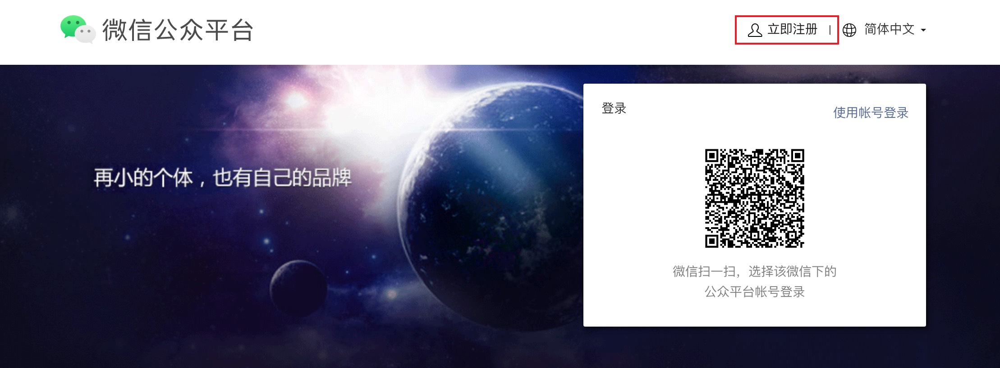
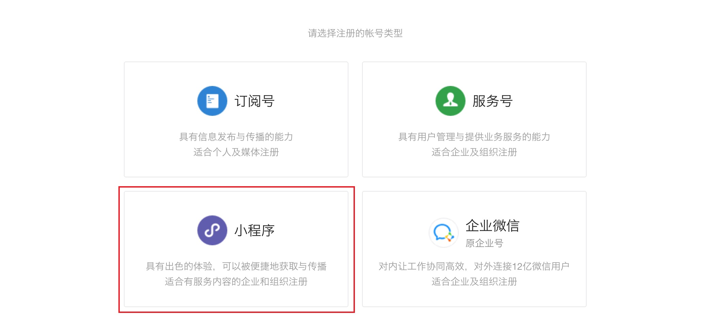
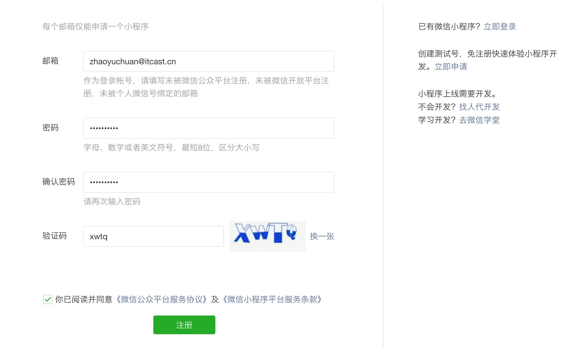
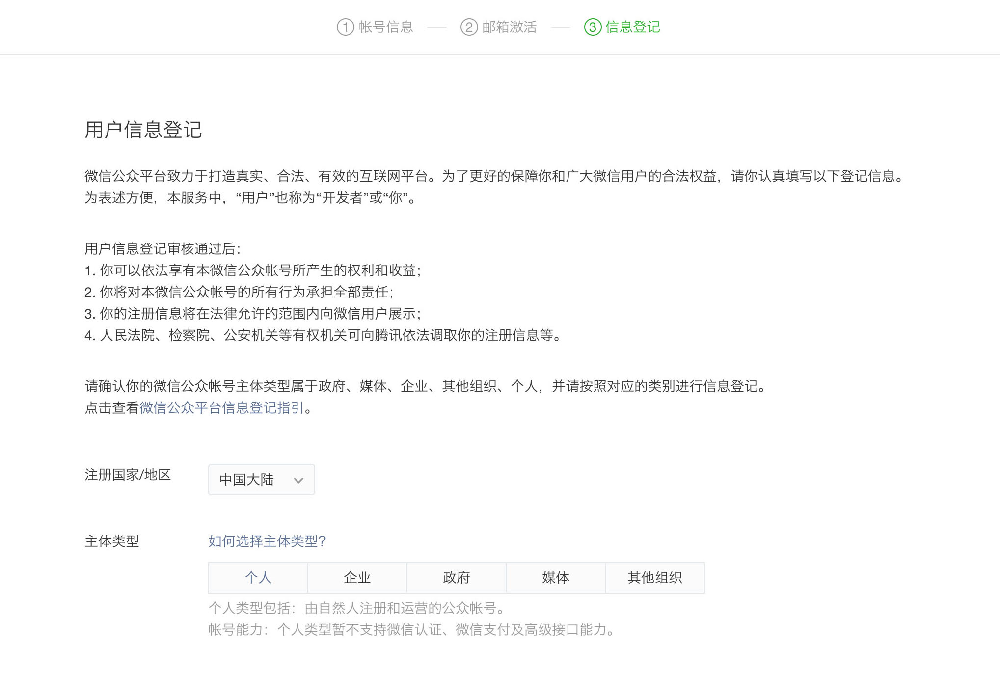
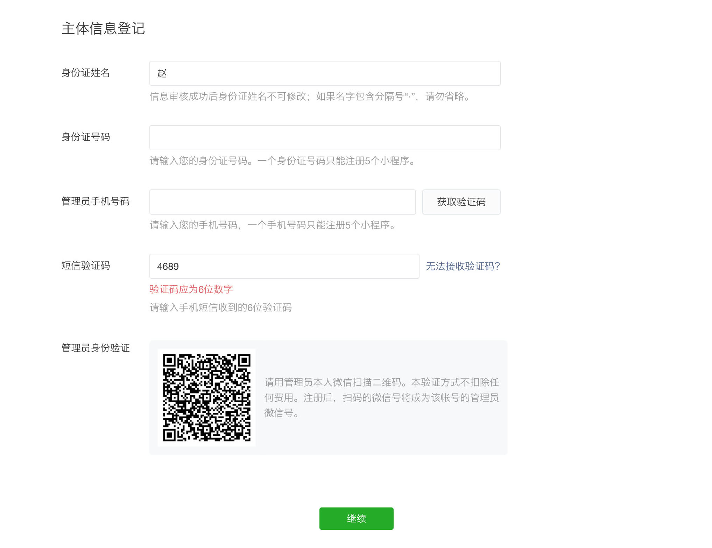
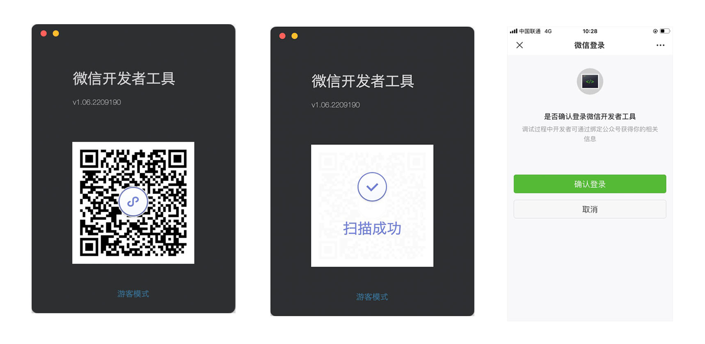

# 开发准备

在正式开始小程序开发之前，不仅需要对小程序的特点有所了解，最重要的是必须要申请一个专门用于小程序开发的账号并下载专门用于小程序开发的工具。

## 1.1 小程序的概念

小程序是一种不需要下载、安装即可使用的应用，它实现了应用触手可及的梦想，用户扫一扫或者搜一下就能打开应用，也实现了用完即走的理念，用户不用安装太多应用，应用随处可用，但又无须安装卸载。
>

1. 特点：无需下载（并非不下载，而是小程序体积非常小，用户感知不到下载的过程 打开任意一个小程序(2MB)、无需卸载
2. 理念：用完即走（让用户在短时间内完成某件操作，用户离开小程序即可，并不需要关注小程序本身）
3. 入口：扫一扫、搜一下、群聊……

## 1.2 注册账号

开发微信小程序前首先要在[微信公众平台](https://mp.weixin.qq.com/)注册一个小程序账号，通过这个账号对小程序的开发进行管理。

注册步骤如下图所示：

1. 点击注册按钮

使用浏览器打开 [微信公众平台](https://mp.weixin.qq.com/ ) 网址，点击右上角的 "立即注册" 即可进入到小程序开发账号的注册流程

1. 选择注册的帐号类型

3. 填写账号信息

4. 邮箱激活

5. 点击链接激活账号

6. 选择主体类型

7. 主体登记信息

8. 注册完毕

## 1.3 小程序信息

账号注册完毕后还需要进一步对小程序的信息进行完善：

注意：在填写小程序类目时**不**需要选择游戏类型

## 1.4 获取AppID

AppID 是小程序的唯一标识，在对小程序进行开发或者上线发布时都会用到 AppID，获取方式如下图所示：

## 1.5 微信开发者工具

微信开发者工具是官方提供的专门用于开发小程序开发，它提供的主要功能如下：

- 快速创建小程序项目（起到脚手架的作用）
- 代码的查看和编辑（相当于 vs code 作用）
- 对小程序功能进行调试（相当于浏览器作用）
- 小程序的预览和发布

[下载](https://developers.weixin.qq.com/miniprogram/dev/devtools/download.html)并安装微信开发者工具，它是一个普通的安装程序，双击后根据引导下一步、下一步操作直到完成，安装完毕后打开微信开发者工具，首次打开时需要先进行登录（使用注册账号时的管理员微信扫码即可）

