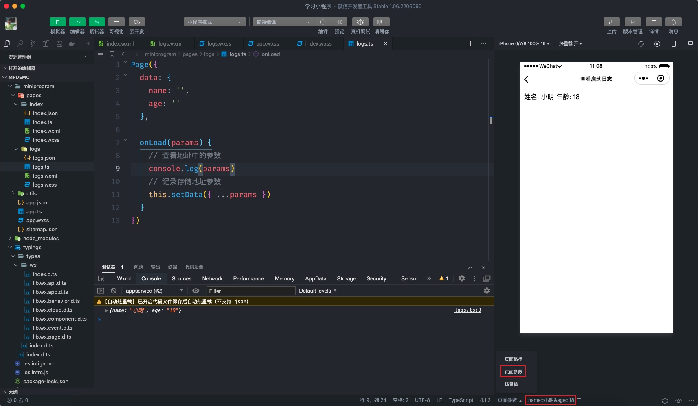

# 生命周期

小程序中的生命周期函数分为【应用级别】的和【页面级别】的。

## 3.1 获取场景值

应用级别的生命周期函数写在 `app.js` 当中：

| 生命周期                                                                            | 必填 | 说明                                |
| ----------------------------------------------------------------------------------- | ---- | ----------------------------------- |
| onLaunch                                                                            | 否   | 监听小程序初始化，全局只会执行 1 次 |
| onShow                                                                              | 否   | 监听小程序启动或切前台              |
| onHide                                                                              | 否   | 监听小程序切后台                    |
| 还有[更多](https://developers.weixin.qq.com/miniprogram/dev/reference/api/App.html) |      |                                     |

通过代码演示用法：

```typescript
// app.ts
App({
  onLaunch() {
    console.log('小程序启动了，只会执行 1 次！')
  },
  onShow() {
    console.log('小程序处于前台状态！')
  },
  onHide() {
    console.log('小程序处于后台状态！')
  },
})
```

应用级别的生命周期函数常常被用来获取小程序的场景值 ID，所谓的场景值是用来描述用户打开小程序的方式，常见的场景值如下表所示：

| 场景值 ID | 说明                           |
| --------- | ------------------------------ |
| 1001      | 发现栏小程序主入口             |
| 1011      | 扫描二维码                     |
| 1007      | 单人聊天会话中的小程序消息卡片 |

```typescript
// app.ts
App({
  onLaunch(params) {
    // 1001 发现栏小程序主入口
    // 1011 扫描二维码
    // 单人聊天会话中的小程序消息卡片
    console.log(params.scene)
  },
  onShow(params) {
    // 也可以获取场景值ID
    console.log(params.scene)
  },
})
```

获取到场景值后就可以确定用户是以[何种方式](https://developers.weixin.qq.com/miniprogram/dev/reference/scene-list.html)打开小程序了。

## 3.2 获取地址参数

页面级别的生命周期函数写在页面对应的页面 `.js` 当中：

| 生命周期                                                                             | 必填 | 说明                                |
| ------------------------------------------------------------------------------------ | ---- | ----------------------------------- |
| onLoad                                                                               | 否   | 监听页面加载，只会执行 1 次         |
| onShow                                                                               | 否   | 监听页面显示                        |
| onReady                                                                              | 否   | 监听页面初次渲染完成，只会执行 1 次 |
| onHide                                                                               | 否   | 监听页面隐藏                        |
| 还有[更多](https://developers.weixin.qq.com/miniprogram/dev/reference/api/Page.html) |      |                                     |

以首页的 `.ts` 为例演示用法：

```typescript
// pages/index/index.ts
Page({
  // ...省略前面小节的代码
  onLoad() {
    // 最前先执行
    console.log('首页面加载了！')
  },
  onShow() {
    // 其次执行
    console.log('首页面显示了！')
  },
  onReady() {
    // 最后执行
    console.log('首页初次渲染完成了！')
  },
  onHide() {
    console.log('首页面隐藏了！')
  },
})
```

上述代码中需要注意【显示/隐藏】的情况包括链接跳转、Tab 切换两种情况，课堂上演示。

生命周期中 `onLoad` 有一个特性需要我们特别注意一下，它能够获取地址中的参数，用法如下所示：

我们先在首页面通过 `navigator` 组件跳转到 `demo` 页面在地址上通过 `?` 拼凑一些参数：

```xml
<!-- page/index/index.wxml -->
<!-- 省略前面小节的代码 -->
<navigator url="/pages/logs/logs">跳转到日志页面</navigator>
```

注意地址上获取的参数数据的类型是字符串，即参数 age 的值为字符串类型

```javascript
// page/logs/logs.ts
Page({
  data: {
    name: '',
    age: '',
  },
  onLoad(params) {
    // 查看地址中的参数
    console.log(params)
    // 记录存储地址参数
    this.setData({ ...params })
  },
})
```

```xml
<!-- pages/logs/logs.wxml -->
<view>姓名: {{name}} 年龄: {{age}}</view>
```

小技巧：小程序开发者工具提供了关于地址参数及页面路径的调试方法，如下图所示：


