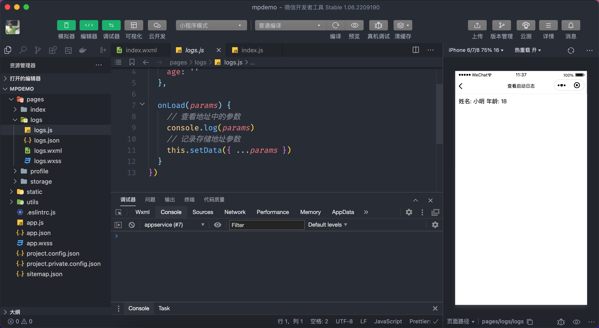

# 生命周期

我们都知道生命周期是一组名称固定且会自动被调用执行的函数，在开发小程序时也有专门的的生命周期函数，分为应用级别、页面级别和组件级别3种类型，我们先学习应用级别和页面级别的生命周期。

## 2.1 应用级别

首先要知道应用级别的生命周期函数定义在 `app.js` 当中，且生命周期函数的名称及执行情况如下表所示：

| 生命周期    | 必填 | 说明 |
| :-------: | :----: | :------------ |
| onLaunch | 否   | 监听小程序初始化，全局只会执行 1 次 |
| onShow | 否   | 监听小程序启动或切前台              |
| onHide | 否   | 监听小程序切后台                    |

### 2.1.1 基本语法

通过代码演示用法：

```javascript
// app.js
App({
  onLaunch() {
    console.log('小程序启动了，只会执行 1 次！')
  },
  onShow() {
    console.log('小程序处于前台状态！')
  },
  onHide() {
    console.log('小程序处于后台状态！')
  },
})
```

::: tip 提示:
用户在点击右上角的胶囊关闭小程序时，小程序并示被销毁，只是将小程序置于后台运行了，因此小 onLaunch 并不会重复执行。
当小程序执行停留在后台约5分钟后小程序会自动被销毁，再次打开小程序时 onLaunch 会再次被执行。
:::

通过应用级别的生命周期可以进行一些全局性的设置，如检测用户的登录状态（后期项目中会用到）、获取小程序的场景值等。

### 2.1.2 场景值

所谓的场景描述的是用户打开小程序的方式，如扫码、搜索、分享等，并且每个场景都对应了一个数值，即场景值，根据这个场景值来判断用户打开小程序的方式，进而分析用户的行为，常见的场景值如下表所示：

| 场景值 ID | 说明                           |
| --------- | ------------------------------ |
| 1001      | 发现栏小程序主入口             |
| 1011      | 扫描二维码                     |
| 1007      | 单人聊天会话中的小程序消息卡片 |

获取小程序的声景值只能在全局生周期函数 `onLaunch`、`onShow` 中获取，代码如下所示

```javascript
// app.js
App({
  onLaunch(params) {
    // 1001 发现栏小程序主入口
    // 1011 扫描二维码
    // 单人聊天会话中的小程序消息卡片
    console.log(params.scene)
  },
  onShow(params) {
    // 也可以获取场景值ID
    console.log(params.scene)
  },
})
```

获取到场景值后就可以确定用户是以[何种方式](https://developers.weixin.qq.com/miniprogram/dev/reference/scene-list.html)打开小程序了，进而分析用户的行为，帮助管理者制订合理的营销方案。

举例说明：比如通过场景值发现最近一段时间大量用户是通过分享的方式打开小程序的，那说明用户分享的意愿很强，营销活动有成效，如果用户主动去搜索小程序，说明小程序的知名度和受欢迎程序都比较高等。

## 2.2 页面级别

页面级别的生命周期函数写在页面对应的页面 `.js` 当中：

| 生命周期  | 必填 | 说明                           |
| :-------------: | :----: | :-------------- |
| onLoad  | 否   | 监听页面加载，只会执行 1 次         |
| onShow  | 否   | 监听页面显示                        |
| onReady | 否   | 监听页面初次渲染完成，只会执行 1 次 |
| onHide   | 否  | 监听页面隐藏                        |
| onUnload | 否   | 监听页面卸载                    |

### 2.2.1 基本语法

以首页的 `.js` 为例演示用法：

```javascript
// pages/index/index.js
Page({
  // ...省略前面小节的代码
  onShow() {
    // 其次执行
    console.log('首页处于显示状态...')
  },

  onReady() {
    console.log('首页初次渲染完成了...')
  },

  onLoad() {
    // 最先执行
    console.log('首页面加载完毕...')
  },

  onHide() {
    console.log('首页处于隐藏状态...')
  },

  onUnload() {
    console.log('首页面即将卸载...')
  }
})
```

通过上述代码的演示大家要掌握页面生命周期的如下特点：

- onLoad 和 onReady 只会执行 1 次
- onShow 和 onHide 会不重复执行
- 普通链接跳转及切换 Tab 页面不会卸载，页面处理隐藏的状态

在开发中页面的生命周期函数会使用非常频繁，根据生命周期的不同特性用法也千变万化，我们先来看 `onLoad` 的一般用法，其它生命周期的应用后续开发中结合需求再做介绍。

### 2.2.2 获取地址参数

小程序在进行页面跳转时可以在跳转地址上通过 `?` 来拼凑参数，这些参数通过 `onLoad` 生命周期函来获取，用法如下所示：

我们在首页面添加一个链接使其跳转到 `logs` 页面，并且在地址上通过 `?` 来拼凑一些参数：

```xml
<!-- page/index/index.wxml -->
<!-- 省略前面小节的代码 -->
<navigator url="/pages/logs/logs?name=小明&age=18">跳转到日志页面</navigator>
```

小程序中通过地址参数与网页是一致的，格式为 `?key1=value1&key2=value2`，上述示例只是介绍基本用法，参数并没有实际的意义。

思考：地址上拼凑的参数是传给哪个页面的？

很容易判断是传给日志页面的，因此获取地址上的参数应该到日志页面的 `onLoad` 中获取，代码如下所示：

```javascript
// page/logs/logs.js
Page({
  data: {
    name: '',
    age: '',
  },
  onLoad(params) {
    // 查看地址中的参数
    console.log(params)

    // 记录存储地址参数
    this.setData({ ...params })
  },
})
```

```xml
<!-- pages/logs/logs.wxml -->
<view>姓名: {{name}} 年龄: {{age}}</view>
```

小技巧：小程序开发者工具提供了关于地址参数及页面路径的调试方法，如下图所示：


