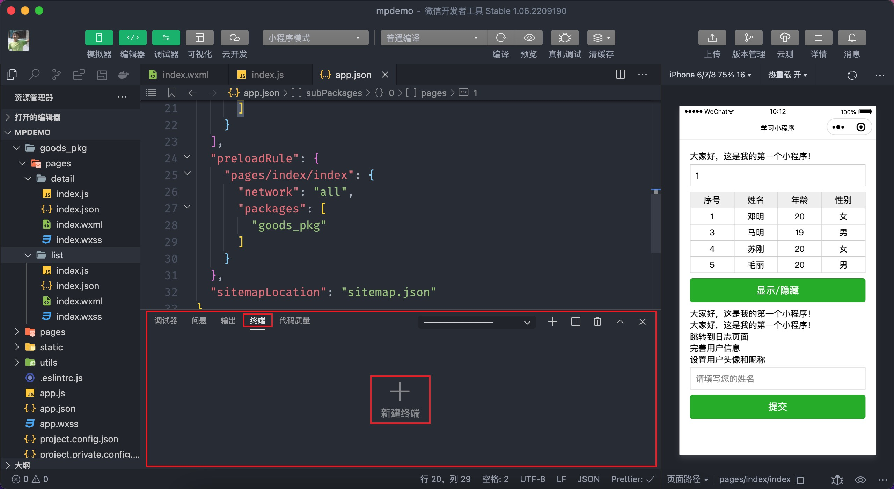
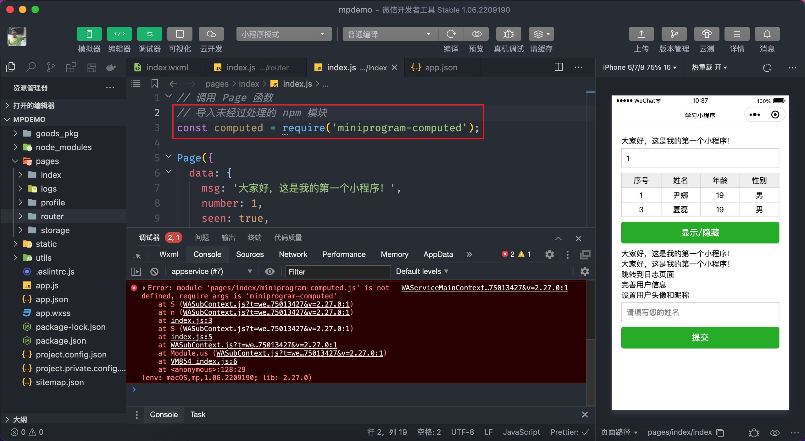
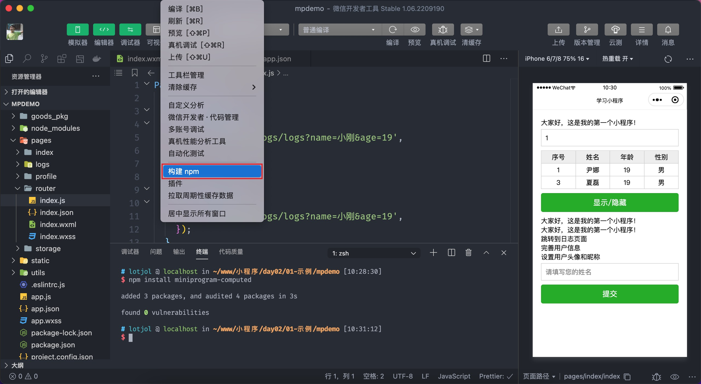

# npm 支持

小程序不能直接使用在 npm 下载的模块包，必须经过小程序开发者工具进行构建后才可以使用，这一节我们来学习支持 npm 模块包的步骤：

1. 打开终端窗口



2. 安装一个 npm 模块包，以 `miniprogram-computed` 为例

```bash
# 创建 package.json
npm init -y

# 安装一个模块
npm install miniprogram-computed
```

这一步操作是与以往的 npm 模块安装没有任何的区别，会将模块安装到 `node_modules` 当中，但是下载的模块无法直接导入到小程序中，如下图所示：



3. 构建 npm，步骤如下图所示



构建 npm 的结果会创建一个新的目录 `miniprogram_npm` 把构建后的 npm 模块放到了这个目录之下，此时在小程序中便可以成功导入 npm 的模块包了。

