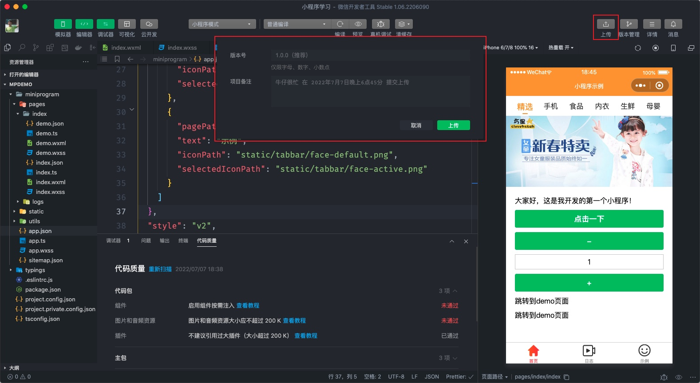
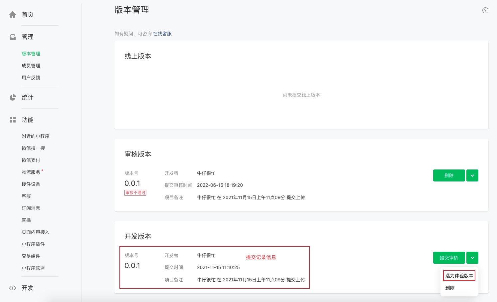
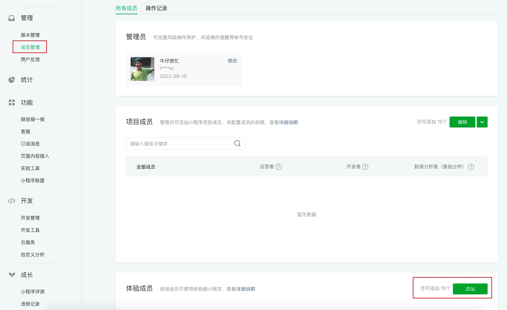
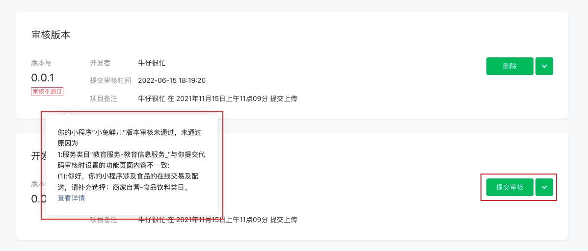

# 4. 发布上线

小程序开发完毕后，最后一个环节就是将小程序发布到微信小程序的应用商店中。

## 4.1 小程序上传

小程序开发并调试完毕后直接点击【上传】按钮，填写版本信息后小程序会被上传到微信的服务器当中，如下图所示：



在上传小程序代码时有一点大家需要注意，微信官方要求小程序的体积不能超过 2M，超过 2M 时上传不会成功，要解决这个问题可以采用分包的功能，这个功能我们在后面再学习。

一般情况小程序的纯代码的体积不会超过 2M，之所以超出多数是由图片导致的，一般的解决方法是将图片放到服务器上而不是在小程序本地。

## 4.2 文件忽略

在开发的初期阶段页面布局使用到的一些图片往往都是放到小程序本地的开发目录当中，当联调接口后获取到数据后图片引用的都是服务器地址，此时本地的图片就已经没有存在的价值了，而且它还会占用小程序的代码体积（不能超过 2M），我们有两个方法解决：一种是将不用的图片删除，另一个种方法是在打包小程序时让开发者工具忽略这些图片，被忽略的文件无法再被打包到小程序项目当中了，因此项目中引用这些图片的地方将无法正常运行，在 `project.config.json` 中进行配置：

```json
{
  "miniprogramRoot": "miniprogram/",
  "packOptions": {
    "ignore": [
      { "type": "folder", "value": "static/uploads" },
      { "type": "file", "value": "ui.zip" }
    ]
  }
}
```

- `"type": "folder"` 忽略文件目录，`"value"` 用来指明具体忽略的文件目录
- `"type": "file"` 忽略文件，`"value"` 用来指明具体忽略的文件

注：上述的配置中 `miniprogramRoot` 用来指定小程序代码的目录。

## 4.3 体验版

上一步骤只是将代码上传到了小程序的官方服务器上，用户还是无法通过小程序商品搜索找到的，需要正式发布前一般还需要进一步对小程序的各项功能进行全方面的测试，即提交【体验版本】，体验版本只能部分用户访问小程序（一般是客户或内部的产品、测试从员），提交体验版本的步骤如下图：



体验成员（客户或内部产品、测试）需要在后台添加，如下图所示：



仍然是通过【微信号】添加体验成员，大家互相添加一下。

## 4.4 提交审核

小程序全面测试完毕后还需要提交给小程序官方审核，主要是看小程序[有无违规的内容](https://developers.weixin.qq.com/community/develop/doc/000c266f094ab00976ad5c0d251809)。



## 4.5 发布

审核通过后就可发布小程序了，发布成功后所有用户都可以在小程序应用商品中找到我们开发的小程序了。
