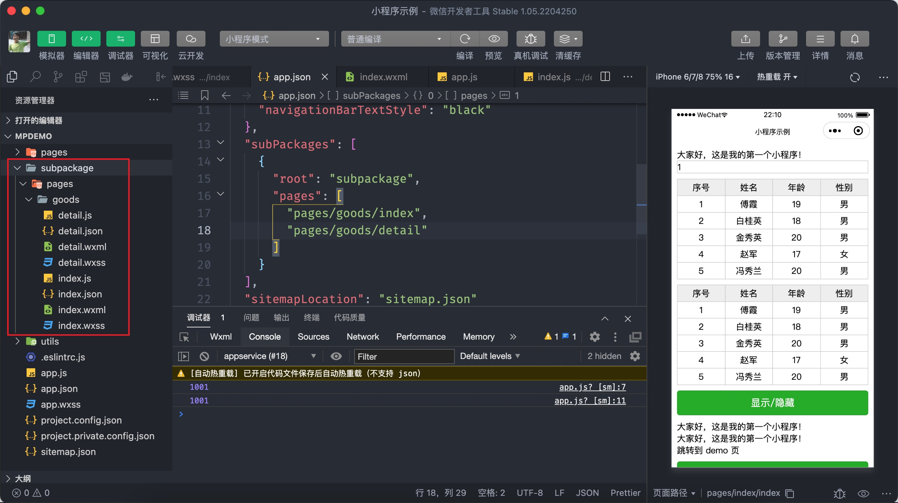

# 配置分包

小程序体积大小限制为 2M，如果小程序项目比较大超过 2M 的情况下，可以通过分包的方式来处理。目前小程序分包大小有以下限制：

- 整个小程序所有分包大小不超过 20M
- 单个分包/主包大小不能超过 2M

## 6.1 使用分包

分包功能本质上就是将某些页面和相关逻辑单独加载，首先在 app.json 文件通过 `subPackages` 配置开启分包的功能：

```json
{
  "pages": ["pages/index/index", "pages/logs/logs", "pages/demo/index"],
  "subPackages": [
    {
      "root": "分包的根路径",
      "name": "分包名称",
      "pages": [
        // 分页页面的路径
      ]
    }
  ]
}
```

下面我来演示一下分包的具体使用方法：

```json
{
  "pages": ["pages/index/index", "pages/logs/logs"],
  "window": {
    "backgroundTextStyle": "light",
    "navigationBarBackgroundColor": "#fff",
    "navigationBarTitleText": "小程序示例",
    "navigationBarTextStyle": "black"
  },
  "subPackages": [
    {
      "root": "subpackage",
      "pages": ["pages/goods/index", "pages/goods/detail"]
    }
  ],
  "sitemapLocation": "sitemap.json"
}
```

上述代码中定义了一个分包的目录名为 `subpackage` （这个名称可以任意起），这个分包下面包含了两个页面，分别是 `pages/goods/idex` 和 `pages/goods/detail`，如果当前目录中不存在 `subpackage` 目录的情况，小程序会自动创建。



以上便是分包的使用了，只需要对小程序进行配置，当小程序在运行的时候再自动根据需要去加载相应的分包，另外与分对应的一个名词是主包，默认 pages 中的页面就是主包的内容。
