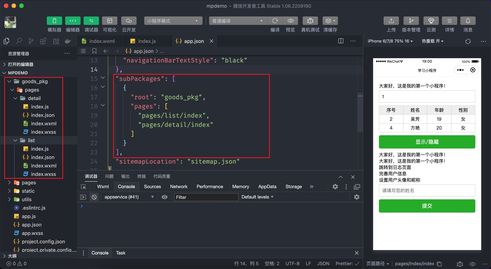

# 分包加载

分包加载有点类似 Vue 中的按需加载的功能，将小程序拆分成若干个部分叫做分包，在分包的基础上能够实现自动加载当前所需部分小程序代码，在一定程序能够提升小程序的加载速度，同时也能解决小程序代码包大小不能超过 2M 的限制。

## 4.1 使用分包

分包从形式上来看就是将某些功能相关的页面及其依赖的资源放到独立的文件夹中，然后在 app.json 文件通过 `subPackages` 配置要加载的分包：

```json
{
  // 省略部分代码...
  "subPackages": [
    {
      "root": "分包的根路径",
      "name": "分包名称",
      "pages": [
        // 分页页面的路径
      ]
    }
  ]
}
```

`subPackages` 的值是数组类型，可以指定多个分包，每个分包含3部分信息，分别为：

- `root` 分包对应的代码根目录，即分包的代码放在哪个文件夹中
- `name` 分包的名称，可以省略
- `pages` 分包中所包含的页面路径


下面咱们来定义一个分包，要求分包的代码位于 `goods_pkg` 目录中，分包中包含两个页面：

```json
{
  "subPackages": [
    {
      "root": "goods_pkg",
      "pages": [
        "pages/list/index",
        "pages/goods/index"
      ]
    }
  ]
}
```

上述代码中定义了一个分包的目录名为 `goods_pkg` （这个名称可以任意起），这个分包下面包含了两个页面，分别是 `pages/goods/idex` 和 `pages/goods/detail`。

::: tip 提示:
如果配置分包的根目录及页面路径不存在，小程序将会自动创建。
:::



以上便是小程序分包的使用步骤了，分包中的页面只有被访问到时小程序才会去下载相应的代码包。

小程序分包对应的是主包，主包就是除了分包以外的代码，`tabBar` 的页面只能放在主包当中，使用分包也不是对代码体积完全没有限制：

- 整个小程序所有分包大小不超过 20M
- 单个分包/主包大小不能超过 2M

## 4.2 分包预下载

分包加载在打开小程序启动的时候只下载主包代码，分包并不会下载，因此能够提升小程序启动时的打开速度，分包的代码只有在访问到分包的页面时才去下载，这样用户就需要有一定时间的等待（一般不太影响），通过分包预加载技术可以实现提前去下载分包的代码，这样分包页面的访问速度也会得到提升。

小程序通过 `preloadRule` 配置需要预加载的分包，在 `app.json` 中进行配置：

- 指定某个页面路径做为 `key`，含义是当访问这个页面时会去预下载一个分包
- `network` 预下载分包的网络条件，可选值为 `all`、`wifi`，默认为 `wifi`
- `packages` 指定要预下载的分包名或根路径


```json
{
  "preloadRule": {
    "pages/index/index": {
      "network": "wifi",
      "packages": ["goods_pkg"]
    }
  },
}
```

上述的代码代表的含义是当用户访问到 `pages/index/index` 时，在 `wifi` 网络前提下预先下载 `goods_pkg` 分包的代码。