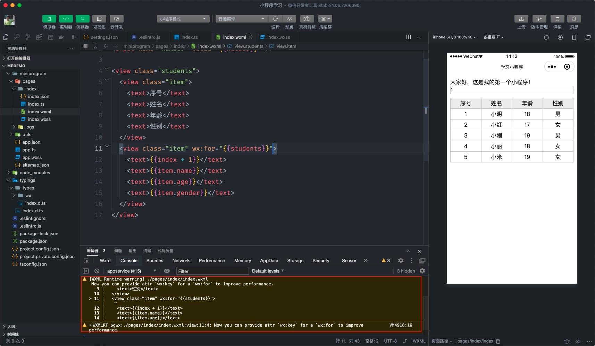

# 模板语法

数据渲染指的是把 data 中的数据展示到页面当中，小程序提供了一套专门的模板语法来实现，值得注意的是小程序的模板语法类似于 Vue 的模板语但又有不同。

::: tip
以下案例的演示我会发大家一些写好的样式表，请大家在命名类名和 wxml 的布局结构尽量跟课堂讲的一致！
:::

## 2.1 数据绑定

小程序中通过插值语法 `{{}}` 实现数据的绑定，将上一小节定义的数据渲染页面当中：

```typescript{19-21}
// pages/index/index.ts
// data 的类型
interface TData {
  /* 省略部分代码... */
}

// 除 data 以外的类型
interface TCustom {
  /* 省略部分代码... */
}

// 调用 Page 函数
Page<TData, TCustom>({
  data: {
    msg: '大家好，这是我的第一个小程序！',
    number: 1,
  },
  // 方法
  sayHi(name = '小明') {
    console.log('你好' + name)
  },
})

export {}
```

```html
<!-- pages/index/index.wxml -->
<view class="msg">{{ msg }}</view>
<!-- 重点注意，属性的绑定也是 {{}} -->
<input name="number" value="{{ number }}" />
```

上述代码就是小程序数据绑定的语法了，重点要注意对【属性的绑定】使用的仍然采用插值语法 `{{}}`

思考一个问题，下述代码中轮播图是否会自动轮播？

```html
<swiper autoplay="false">
  <swiper-item>
    <image src=""></image>
  </swiper-item>
  <swiper-item>
    <image src=""></image>
  </swiper-item>
</swiper>
```

::: v-pre
答案：上述代码中 `autoplay="false"` 并不会禁止自动轮播，这里的 `false` 会被当成字符串，并不是布尔类型的值，要表示布尔类型的值必须写成`autoplay="{{ false }}"`。
:::

## 2.2 列表渲染

如果 data 中有一个数组类型的列表数据，我们要如何渲染出来呢？
小程序提供了一个指令 `wx:for` 类似于 Vue 中的 `v-for`，通过一个小例子来学习：

```typescript{6-11,24-30}
// pages/index/index.ts
// data 的类型
interface TData {
  msg?: string
  number?: number
  students: {
    id: number
    name: string
    age: number
    gender: string
  }[]
}

// 除 data 以外的类型
interface TCustom {
  /* 省略部分代码... */
}

// 调用 Page 函数
Page<TData, TCustom>({
  data: {
    msg: '大家好，这是我的第一个小程序！',
    number: 1,
    students: [
      { id: 1, name: '小明', age: 18, gender: '男' },
      { id: 2, name: '小红', age: 17, gender: '女' },
      { id: 3, name: '小刚', age: 19, gender: '男' },
      { id: 4, name: '小丽', age: 18, gender: '女' },
      { id: 5, name: '小米', age: 19, gender: '女' },
    ],
  },
  // 方法
  sayHi(name = '小明') {
    console.log('你好' + name)
  },
})

export {}
```

1. **基本的语法格式**

`wx:for` 的语法格式为 `wx:for="{{ 数据名称 }}"` ，并且**内置默认**提供 `index` 获取数组的**索引值**，`item` 访问**数组的单元**，如下代码所示：

```xml
<!-- pages/index/index -->
<view class="students">
  <view class="item">
    <text>序号</text>
    <text>姓名</text>
    <text>年龄</text>
    <text>性别</text>
  </view>
  <view class="item" wx:for="{{ students }}">
    <text>{{ index + 1 }}</text>
    <text>{{ item.name }}</text>
    <text>{{ item.age }}</text>
    <text>{{ item.gender }}</text>
  </view>
</view>
```

在使用 `wx:for` 时会收到一个警告，如下图：



上述警告是由于在使用 `wx:for` 时没有指定 `wx:key` 属性，这个 `wx:key` 属性的作用于 Vue 中一样的，但是语法稍有不同，大家一定要注意，如下所示：

```xml{9}
<!-- pages/index/index -->
<view class="students">
  <view class="item">
    <text>序号</text>
    <text>姓名</text>
    <text>年龄</text>
    <text>性别</text>
  </view>
  <view class="item" wx:for="{{ students }}" wx:key="name">
    <text>{{ index + 1 }}</text>
    <text>{{ item.name }}</text>
    <text>{{ item.age }}</text>
    <text>{{ item.gender }}</text>
  </view>
</view>
```

上述代码中 `wx:key` 属性的值要求必须具有唯一性，**如果数组单元是一个对象时只要写这个对象的属性名就可以了，这一点和 Vue 的语法是不一样的。**

1. **自定义访问单元值和索引值**

如果想要改变默认的 `index` 或 `item` 可以通过 `wx:for-index` 和 `wx:for-item` 分别来指定，如下代码所示：

```xml{9}
<!-- pages/index/index -->
<view class="students">
  <view class="item">
    <text>序号</text>
    <text>姓名</text>
    <text>年龄</text>
    <text>性别</text>
  </view>
  <view class="item" wx:for="{{ students }}" wx:for-index="key" wx:for-item="student">
    <text>{{ key + 1 }}</text>
    <text>{{ student.name }}</text>
    <text>{{ student.age }}</text>
    <text>{{ student.gender }}</text>
  </view>
</view>
```

上述代码中分别指定了 `key` 和 `student` 来分别获取数组的索引值和单元值。

## 2.3 条件渲染

在对数据进行渲染时还可以根据条件来处理，这个语法类似于 Vue 中的 `v-if` 和 `v-show`，我们来看具体的用法：

```xml
<!-- pages/index/index.wxml -->
<!-- 省略前面小节的代码 -->
<button type="primary" bind:tap="toggle">显示/隐藏</button>
<view wx:if="{{ seen }}">{{msg}}</view>
<view hidden="{{ !seen }}">{{msg}}</view>
```

```typescript{7,20,41-46}
// pages/index/index.ts
// data 的类型
interface TData {
  msg?: string
  number?: number
  // 新增加 seen
  seen: boolean
  students: {
    id: number
    name: string
    age: number
    gender: string
  }[]
}

// 除 data 以外的类型
interface TCustom {
  sayHi(name: string): void
  // 新增加 toggle
  toggle(): void
}

// 调用 Page 函数
Page<TData, TCustom>({
  data: {
    msg: '大家好，这是我的第一个小程序！',
    number: 1,
    students: [
      { id: 1, name: '小明', age: 18, gender: '男' },
      { id: 2, name: '小红', age: 17, gender: '女' },
      { id: 3, name: '小刚', age: 19, gender: '男' },
      { id: 4, name: '小丽', age: 18, gender: '女' },
      { id: 5, name: '小米', age: 19, gender: '女' },
    ],
  },
  // 方法
  sayHi(name = '小明') {
    console.log('你好' + name)
  },

  toggle() {
    // 切换 seen 的值
    this.setData({
      seen: !this.data.seen,
    })
  },
})

export {}
```

- `wx:if` 在条件为 `true` 时会将内容渲染出来，否则不会进行渲染，它和 Vue 的 `v-if` 是通过添加/删除节点实现内容的显示/隐藏的操作。

- `hidden` 在条件为 `true` 时会隐藏内容，它的显示/隐藏是通过 `display` 来实现的。

另外还有 `wx:else`、`wx:elif` 在课堂上就给大家演示了。
