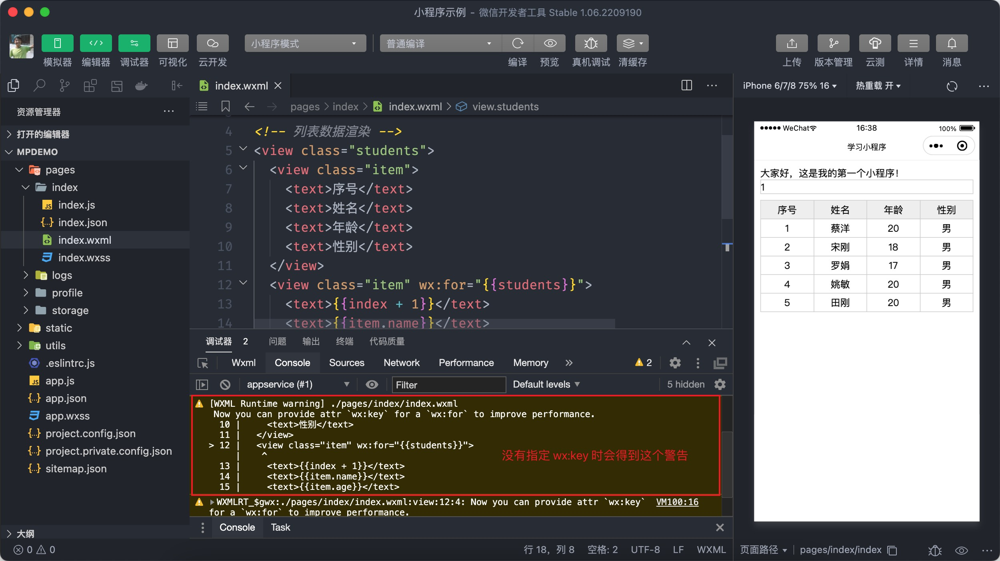

# 模板语法

数据渲染是指通过模板语法把 data 中的数据展示到页面当中，小程序有一套专门的模板语法来实现数据的渲染。

::: tip
以下案例的演示我会发大家一些写好的样式表，大家写代码时类名和 wxml 的布局结构尽量跟课堂讲的一致！
:::

## 1.1 双向绑定

小程序中通过插值语法，即双大括号实现数据的绑定，我们来将上一小节定义的数据渲染到页面当中：

```javascript{19-21}
// pages/index/index.js
// 调用 Page 函数
Page({
  data: {
    msg: '大家好，这是我的第一个小程序！',
  },
  // 方法
  sayHi(name = '小明') {
    console.log('你好' + name)
  },
})
```

```xml
<!-- pages/index/index.wxml -->
<view class="msg">{{msg}}</view>
<!-- 重点注意，属性的绑定也是 {{}} -->
<input name="number" value="{{msg}}" />
```

上述代码就是小程序数据绑定的语法了，重点要注意对【属性的绑定】使用的仍然采用插值语法。

小程序支持简易的数据双向绑定，语法如下所示：

```xml
<input name="number" model:value="{{msg}}" />
```

大家要注意并不是所有的表单元素都支持数据双向绑定，其中 `input`、`textarea`、`slider` 组件可以支持。

思考一个问题，下述代码中轮播图是否会自动轮播？

```xml{1}
<swiper autoplay="false">
  <swiper-item>
    <image src=""></image>
  </swiper-item>
  ...
</swiper>
```

::: v-pre
答案：上述代码中 `autoplay="false"` 并不会禁止自动轮播，这里的 `false` 会被当成字符串，并不是表达式，因此这里不是布尔类型的值，要表示布尔类型的值必须写成`autoplay="{{ false }}"`，`{{}}` 中的内容会当成表达式来进行解析。
:::


## 1.2 列表渲染

如果 data 中有一个数组类型的列表数据，我们要如何渲染出来呢？
小程序提供了一个指令 `wx:for` 类似于 Vue 中的 `v-for`，通过一个小例子来学习：

```javascript{7-12}
// pages/index/index.js
// 调用 Page 函数
Page({
  data: {
    msg: '大家好，这是我的第一个小程序！',
    number: 1,
    students: [
      { id: 1, name: '小明', age: 18, gender: '男' },
      { id: 2, name: '小红', age: 17, gender: '女' },
      { id: 3, name: '小刚', age: 19, gender: '男' },
      { id: 4, name: '小丽', age: 18, gender: '女' },
      { id: 5, name: '小米', age: 19, gender: '女' },
    ],
  },
  // 方法
  sayHi(name = '小明') {
    console.log('你好' + name)
  },
})
```

### 1.2.1 基本的语法格式

::: v-pre
`wx:for` 的语法格式为 `wx:for="{{ 数据名称 }}"` ，并且**内置默认**通过 `index` 获取数组的**索引值**，`item` 访问**数组的单元值**，如下代码所示：
:::

```xml
<!-- pages/index/index -->
<view class="students">
  <view class="item">
    <text>序号</text>
    <text>姓名</text>
    <text>年龄</text>
    <text>性别</text>
  </view>
  <view class="item" wx:for="{{students}}">
    <text>{{index + 1}}</text>
    <text>{{item.name}}</text>
    <text>{{item.age}}</text>
    <text>{{item.gender}}</text>
  </view>
</view>
```

上述代码中 `index` 读取的是数组的索引值，`item` 读取的是数组的单元。

在使用 `wx:for` 时会收到一个警告，如下图：



上述警告是由于在使用 `wx:for` 时没有指定 `wx:key` 属性，这个 `wx:key` 属性的作用于 Vue 中一样的，但是语法稍有不同，大家一定要注意，如下所示：

```xml{9}
<!-- pages/index/index -->
<view class="students">
  <view class="item">
    <text>序号</text>
    <text>姓名</text>
    <text>年龄</text>
    <text>性别</text>
  </view>
  <view class="item" wx:for="{{students}}" wx:key="name">
    <text>{{index + 1}}</text>
    <text>{{item.name}}</text>
    <text>{{item.age}}</text>
    <text>{{item.gender}}</text>
  </view>
</view>
```

上述代码中 `wx:key` 属性的值要求必须具有唯一性，使用时分成两种情形：

- 数组单元为简单类型数据时，使用 `*this` 指定为 `wx:key` 的值
- 数组单元是对象类型时，只要写对象的属性名

### 1.2.2 自定义访问单元值和索引值

开发中 `wx:for` 的嵌套是比较常见的，外层 `wx:for` 和内层的 `wx:for` 都使用 `index` 和 `item` 来访问数组的索引和单元，会使得代码的易读性比较差，这种情况下通过 `wx:for-index` 和 `wx:for-item` 来分别指定如何访问数组的索引值和单元值，如下代码所示：

```xml{9}
<!-- pages/index/index -->
<view class="students">
  <view class="item">
    <text>序号</text>
    <text>姓名</text>
    <text>年龄</text>
    <text>性别</text>
  </view>
  <view class="item" wx:for="{{students}}" wx:for-index="key" wx:for-item="student">
    <text>{{key + 1}}</text>
    <text>{{student.name}}</text>
    <text>{{student.age}}</text>
    <text>{{student.gender}}</text>
  </view>
</view>
```

上述代码中分别指定了 `key` 获取的是数组的索引值，`student` 获取的是数组的单元值。

## 1.3 条件渲染

### 1.3.1 wx:if

在对数据进行渲染时经常需要根据条件来处理，如只渲染年龄大于18岁的学员，可以使用 `wx:if` 来实现，我们来看具体的用法：

```xml{12}
<!-- pages/index/index.wxml -->
<!-- 省略前面小节的代码 -->
<view class="students">
  <view class="item">
    <text>序号</text>
    <text>姓名</text>
    <text>年龄</text>
    <text>性别</text>
  </view>
  <view
    class="item"
    wx:if="{{item.age > 18}}"
    wx:for="{{students}}"
    wx:key="name"
  >
    <text>{{index + 1}}</text>
    <text>{{item.name}}</text>
    <text>{{item.age}}</text>
    <text>{{item.gender}}</text>
  </view>
</view>
```

### 1.3.2 hidden

除了使用 `wx:if` 来控制元素的显示外，还可以使用 `hidden` 属性来实现相同的结果。

```javascript{7,15-20}
// pages/index/index.js
// 调用 Page 函数
Page({
  data: {
    msg: '大家好，这是我的第一个小程序！',
    number: 1,
    seen: true,
    students: [],
  },
  // 方法
  sayHi(name = '小明') {
    console.log('你好' + name)
  },

  toggle() {
    // 切换 seen 的值
    this.setData({
      seen: !this.data.seen,
    })
  },
})
```

```xml
<!-- 条件数据渲染 -->
<button type="primary" bind:tap="toggle">显示/隐藏</button>
<view wx:if="{{seen}}">{{msg}}</view>
<view hidden="{{!seen}}">{{msg}}</view>
```

对比 `wx:if` 和 `hidden` 二者的区别：

- `wx:if` 在条件为 `true` 时会将内容渲染出来，否则不会进行渲染，是通过【添加/删除】节点的方式来实现的。

- `hidden` 在条件为 `true` 时会隐藏内容，否则会显示内容，是通过 `display` 样式属性来实现的。

### 1.3.3 wx:else

根据条件来渲染页面经常需要处理两种状态，如用户已登录则可以完善用户信息，未登录则必须先进行登录，这种场景会用于 `wx:else` 来处理，具体如下所示：

```html
<!-- pages/index/index.wxml -->
<!-- 省略前面小节的代码 -->
<view wx:if="{{isLogin}}">完善用户信息</view>
<view wx:else>请先登录</view>
```

```javascript{8}
// pages/index/index.js
// 调用 Page 函数
Page({
  data: {
    msg: '大家好，这是我的第一个小程序！',
    number: 1,
    seen: true,
    isLogin: false,
    students: [],
  },
  // 省略部分代码...
})
```

::: warning 注意
`wx:else` 不能单独使用，必须配合 `wx:if`，另外还有 `wx:elif` 在课堂上就给大家演示了。
:::

### 1.3.4 block

`block` 是小程序中一个特殊的标签，用于分组控制页面元素的渲染，通过会配合 `wx:for` 和 `wx:if` 来使用，下面举例来说明：

假如有一个列表数据需要渲染，我们要求只有列表的长度大于 0 时才渲染，否则给用户一个提示信息。

```xml{1,13,15}
<block wx:if="{{isLogin}}">
  <view class="msg">{{msg}}</view>
  <input name="number" value="{{number}}" />
  <!-- 列表数据渲染 -->
  <view class="students">...</view>
  <!-- 条件数据渲染 -->
  <button type="primary" bind:tap="toggle">显示/隐藏</button>
  <view wx:if="{{seen}}">{{msg}}</view>
  <view hidden="{{!seen}}">{{msg}}</view>

  <view wx:if="{{isLogin}}">完善用户信息</view>
  <view wx:else>请先登录</view>
</block>

<view wx:else class="tips">空空如也~</view>
```
::: tip 提示:
block 标签本身并不会被渲染到页面当中，它一般只用于分组控制内容的渲染，也可以用 wx:for
:::