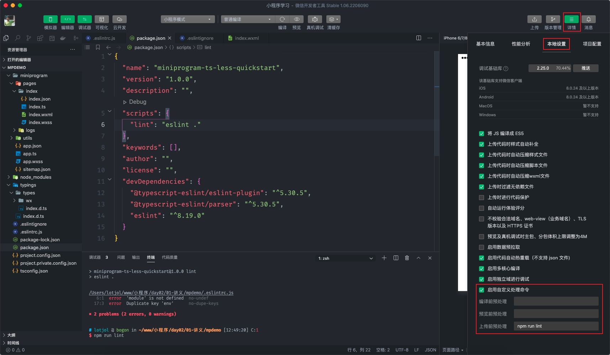

# 小程序进阶

小程序即支持使用 Javascript 开发，也支持 Typescript 开发。

## 1.1 类型声明

在使用 Typescript 来开发微信小程序时需要安装声明文件，如果创建项目时选择的是 Typescript 版本，那小程序开发者工具会自动创建声明文件，这些文件放在 `typings/types` 目录中并且自动对 `tsconfig.json` 进行了初始的配置。

```json
{
  "compilerOptions": {
  	// 省略了一些其它配置
    "typeRoots": [
      "./typings"
    ]
  },
  "include": [
    "./**/*.ts"
  ],
  "exclude": [
    "node_modules"
  ]
}
```

配置文件中要注意 `typeRoots` 指向的目录是 `./typings`，默认为 `node_modules/@types`。

声明文件也可以单独安装，后面基于 uni-app 框架开发时采用以下的方式安装。

```bash
npm install @types/wechat-miniprogram
# 或者
npm install miniprogram-api-typings
```

## 1.2 泛型

默认情况 typescript 会自动推断初始数据 `msg` 和 `number` 数据的类型

```typescript
// page/index/index.ts
Page({
  data: {
    msg: '大家好，这是我的第一个小程序！',
    number: 1
  }
})
```

1.  Page 函数

有很多时候需要开发者事先对类理进行定义，比如调用接口获取的数据列表，这样可以更好的利用 `typescript` 的提示功能，此时就需要为 `Page` 函数指定**泛型参数**来实现，总共需要 2 个泛型参数：

- 第1个泛型参数用来约束 `data` 初始数据的类型

```typescript
// data 的类型
interface TData {
  msg?: string,
  number?: number,
  students: {
    id: number,
    name: string,
    age: number,
    gender: string
  }[]
}

// 除 data 以外的类型
interface TCustom {}

// 调用 Page 函数
Page<TData, TCustom>({
  data: {
    msg: '大家好，这是我的第一个小程序！',
    number: 1,
    students: [
      { id: 1, name: '小明', age: 18, gender: '男' },
      { id: 2, name: '小红', age: 17, gender: '女' },
      { id: 3, name: '小刚', age: 19, gender: '男' },
      { id: 4, name: '小丽', age: 18, gender: '女' },
      { id: 5, name: '小米', age: 19, gender: '女' }
    ]
  }
})
```

- 第2个泛型参数用来约束除 `data` 以外部分数据的类型，如事件回调、公共方法等

```typescript
// data 的类型
interface TData {
  msg?: string,
  number?: number,
  students: {
    id: number,
    name: string,
    age: number,
    gender: string
  }[]
}

// 除 data 以外的类型
interface TCustom {
  sayHi(name: string): void
}

// 调用 Page 函数
Page<TData, TCustom>({
  data: {
    msg: '大家好，这是我的第一个小程序！',
    number: 1,
    students: [
      { id: 1, name: '小明', age: 18, gender: '男' },
      { id: 2, name: '小红', age: 17, gender: '女' },
      { id: 3, name: '小刚', age: 19, gender: '男' },
      { id: 4, name: '小丽', age: 18, gender: '女' },
      { id: 5, name: '小米', age: 19, gender: '女' }
    ]
  },
  
  // 方法
  sayHi(name = '小明') {
    console.log('你好' + name)
  }
})
```

上述代码中定义的类型是暴露在全局当中的，为了避免引起冲突我们在文件结尾添加 `export {}` 来解决：

```typescript
// data 的类型
interface TData {/* 省略部分代码... */}

// 除 data 以外的类型
interface TCustom {/* 省略部分代码... */}

// 调用 Page 函数
Page<TData, TCustom>({
	// ... 省略部分代码
})

// 新增的代码
export {}
```

2. App 函数

App 函数只需要一个泛型参数：

```typescript
// app.ts
interface IAppOption {
  someGlobalData?: {
    version?: string,
    author?: string
  },
  foo(arg: number): number
}

// App 函数
App<IAppOption>({
  someGlobalData: {
    version: 'v1.0',
    author: 'botue'
  },

  foo(arg) {
    return arg
  },
})
```

在 App 函数中定义的数据可以任何页面通过 getApp 方法全局获取：

```typescript
// pages/inddex/index.ts

// 获取 App 中定义的属性或方法
const app: IAppOption = getApp();
console.log(app)

// data 的类型
interface TData {/* 省略部分代码 */}
// 除 data 以外的类型
interface TCustom {/* 省略部分代码 */}
// 调用 Page 函数
Page<TData, TCustom>({/* 省略部分代码 */})

export { }
```

## 1.3 ESLint

在小程序开发者工具配置 eslint 对 Typescript 进行检验。

1. 安装 `eslint` 和 `@typescript-eslint`：

```bash
npm install eslint @typescript-eslint/paraer @typescript-eslint/eslint-plugin --save-dev
```

2. 修改 `.eslintrc.js` 配置文件

```diff
	module.exports = {
+   parser: '@typescript-eslint/parser',
+   plugins: [
+     '@typescript-eslint',
+  ],
    env: {/* 省略部分代码 */},
-     ecmaFeatures: {
-      modules: true,
-    },
    parserOptions: {
      ecmaVersion: 2018,
      sourceType: 'module',
+     ecmaFeatures: {
+      modules: true,
+    },
    },
    globals: {/* 省略部分代码 */},
-   extends: 'eslint:recommended',
+   extends: [
+     'eslint:recommended',
+     'plugin:@typescript-eslint/recommended',
+   ],
    rules: {},
  }
```

3. 添加 eslint 验证脚本，目前小程序开发者工具中不支持 ESLint 插件，因此无法实时检测代码是否书写规范

```diff
  {
    "name": "学习小程序",
    "version": "1.0.0",
    "description": "",
    "scripts": {
+			"lint": "eslint ."
    },
    "keywords": [],
    "author": "",
    "license": "",
    "devDependencies": {
      "@typescript-eslint/eslint-plugin": "^5.30.5",
      "@typescript-eslint/parser": "^5.30.5",
      "eslint": "^8.19.0"
    }
  }
```

配置以上的脚本后可以通过 `npm run lint` 来调用 `eslint` 检测代码是否规范。

4. 忽略 `eslit` 检测，将小程序的类型声明文件排除在 `eslint` 的检测清单之外

在小程序项目的根目录下创建  `.eslintignore` 将小程序类型声明文件目录加入到该文件当中：

```
typings/types/wx
```

配置的 `eslint` 默认不允许导出一个空的对象，更新配置关掉这条验证规则：

```diff
module.exports = {
  parser: '@typescript-eslint/parser',
  plugins: [
    '@typescript-eslint',
  ],
  env: {/* 省略部分代码 */},
  parserOptions: {/** 省略部分代码 **/},
  globals: {/** 省略部分代码 **/},
  extends: [
    'eslint:recommended',
    'plugin:@typescript-eslint/recommended',
  ],
  rules: {
+   '@typescript-eslint/no-empty-interface': 0
  },
}
```

5. 启用自定义处理命令，小程序开发者工具支持在编译、预览、上传小程序是执行自定义的命令，如 `npm run lint`。



